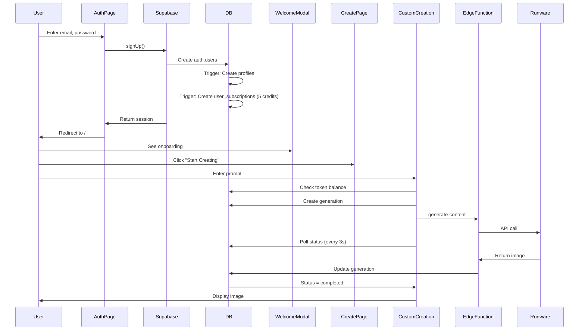
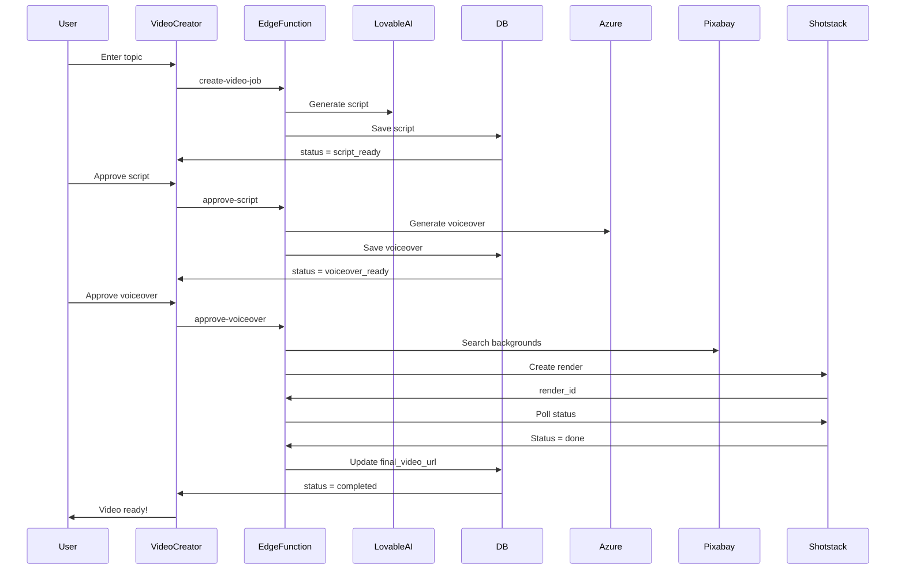
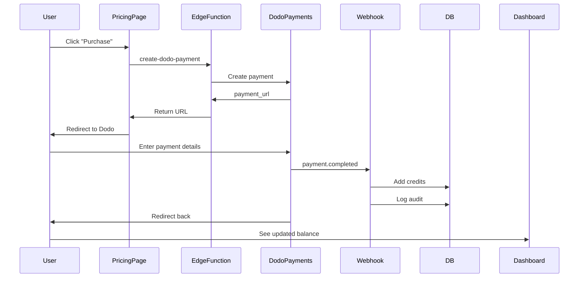

# Artifio.ai - Comprehensive Technical Documentation

**Version:** 1.0.0  
**Last Updated:** 2025-11-02  
**Project:** Artifio.ai - AI-Powered Content Generation Platform  
**Tech Stack:** React + TypeScript + Vite + Supabase + Tailwind CSS  

---

## Table of Contents

1. [Project Overview](#1-project-overview)
2. [Technology Stack](#2-technology-stack)
3. [Architecture Overview](#3-architecture-overview)
4. [Database Schema](#4-database-schema)
5. [Authentication & Authorization](#5-authentication--authorization)
6. [API Integrations](#6-api-integrations)
7. [Environment Variables](#7-environment-variables)
8. [Component Structure](#8-component-structure)
9. [Routing](#9-routing)
10. [State Management](#10-state-management)
11. [Styling & UI](#11-styling--ui)
12. [Forms & Validation](#12-forms--validation)
13. [Data Fetching & Caching](#13-data-fetching--caching)
14. [File Uploads](#14-file-uploads)
15. [Real-Time Features](#15-real-time-features)
16. [Payment Integration](#16-payment-integration)
17. [Email/Notifications](#17-emailnotifications)
18. [Error Handling & Logging](#18-error-handling--logging)
19. [Security Measures](#19-security-measures)
20. [Deployment Configuration](#20-deployment-configuration)
21. [Performance Optimizations](#21-performance-optimizations)
22. [Testing](#22-testing)
23. [Dependencies & Versions](#23-dependencies--versions)
24. [Known Issues & Bugs](#24-known-issues--bugs)
25. [Special Configurations](#25-special-configurations)
26. [Database Relationships & Queries](#26-database-relationships--queries)
27. [User Flows](#27-user-flows)

---

## 1. Project Overview

### Purpose
Artifio.ai is a comprehensive AI-powered content generation platform that enables users to create images, videos, storyboards, and custom AI workflows using various AI models.

### Core Features
- **Multi-Model AI Generation**: Supports 20+ AI models (Flux, Stable Diffusion, Midjourney, etc.)
- **Template-Based Creation**: 50+ pre-configured templates for common use cases
- **Custom Workflows**: Visual workflow builder for complex AI pipelines
- **Video Studio**: Automated video creation with AI-generated scripts and voiceovers
- **Storyboard Creator**: Multi-scene video storyboards with synchronized audio
- **Token-Based Billing**: Credit system for usage tracking and monetization
- **Admin Dashboard**: Complete management interface for models, templates, and users

### Target Users
- Content creators and marketers
- Social media managers
- Video producers
- Graphic designers
- Business owners needing visual content

### Business Model
**Freemium with Credit System**
- Free tier: 5 credits on signup
- Paid tiers: $4.99 - $99.99/month (100-3000 credits)
- Pay-per-use model (no recurring subscription currently)

---

## 2. Technology Stack

### Frontend
- **Framework**: React 18.3.1
- **Build Tool**: Vite 5.4.19
- **Language**: TypeScript 5.8.3
- **Styling**: Tailwind CSS 3.4.17 + shadcn/ui components
- **Routing**: React Router DOM 6.30.1
- **State Management**: React Query 5.83.0 + Context API
- **Forms**: React Hook Form 7.61.1 + Zod 3.25.76
- **UI Components**: Radix UI primitives + custom components

### Backend
- **Database**: PostgreSQL (via Supabase)
- **Authentication**: Supabase Auth
- **Storage**: Supabase Storage
- **Serverless Functions**: Supabase Edge Functions (Deno)
- **Real-time**: Supabase Realtime (prepared but not actively used)

### External APIs
- **Image Generation**:
  - Runware API (primary)
  - Kie.ai API (secondary)
- **Video Generation**:
  - Shotstack API (video rendering)
  - Pixabay API (stock footage/music)
- **Voice/Audio**:
  - Azure Cognitive Services (TTS)
  - ElevenLabs (premium voices)
- **AI/LLM**:
  - Lovable AI (built-in models: GPT-5, Gemini 2.5)
- **Payments**:
  - Dodo Payments (African payment gateway)

### Mobile
- **Framework**: Capacitor 7.4.3
- **Platforms**: iOS + Android
- **Native Features**: Camera, Share, File System, Haptics

### Development Tools
- **Package Manager**: npm
- **Linting**: ESLint 9.18.0
- **Type Checking**: TypeScript
- **Version Control**: Git
- **Deployment**: Lovable Cloud

---

## 3. Architecture Overview

### System Architecture

```
┌─────────────────────────────────────────────────────────────┐
│                         Client Layer                         │
│  ┌────────────┐  ┌────────────┐  ┌─────────────────────┐   │
│  │ Web App    │  │ iOS App    │  │ Android App         │   │
│  │ (React)    │  │ (Capacitor)│  │ (Capacitor)         │   │
│  └─────┬──────┘  └─────┬──────┘  └──────────┬──────────┘   │
└────────┼───────────────┼────────────────────┼──────────────┘
         │               │                    │
         └───────────────┴────────────────────┘
                         │
                         ▼
         ┌───────────────────────────────────┐
         │     Supabase Client (JS SDK)      │
         └───────────────┬───────────────────┘
                         │
         ┌───────────────┴───────────────────────────────┐
         │                                               │
         ▼                                               ▼
┌─────────────────┐                            ┌──────────────────┐
│  Supabase Auth  │                            │  Supabase DB     │
│  - JWT Tokens   │                            │  - PostgreSQL    │
│  - RLS Policies │                            │  - Row Level     │
│  - User Mgmt    │                            │    Security      │
└─────────────────┘                            └──────────────────┘
         │                                               │
         │                                               │
         ▼                                               ▼
┌──────────────────────────────────────────────────────────────┐
│              Supabase Edge Functions (Deno)                  │
│  ┌────────────┐  ┌────────────┐  ┌─────────────────────┐   │
│  │ generate-  │  │ create-    │  │ workflow-executor   │   │
│  │ content    │  │ video-job  │  │                     │   │
│  └─────┬──────┘  └─────┬──────┘  └──────────┬──────────┘   │
└────────┼───────────────┼────────────────────┼──────────────┘
         │               │                    │
         └───────────────┴────────────────────┘
                         │
         ┌───────────────┴───────────────────────────────┐
         │               │               │               │
         ▼               ▼               ▼               ▼
┌─────────────┐  ┌──────────────┐  ┌─────────┐  ┌──────────┐
│  Runware    │  │  Shotstack   │  │  Azure  │  │  Dodo    │
│  API        │  │  API         │  │  TTS    │  │ Payments │
│  (Images)   │  │  (Videos)    │  │ (Voice) │  │          │
└─────────────┘  └──────────────┘  └─────────┘  └──────────┘
```

### Data Flow

**Image Generation Flow:**
```
User Input → Validation → Token Check → Create DB Record → 
Edge Function → Runware API → Webhook/Polling → 
Update DB → Display Result → Store in Supabase Storage
```

**Video Generation Flow:**
```
User Input → Script Generation (AI) → User Approval → 
Voiceover Generation (Azure/ElevenLabs) → User Approval → 
Background Media Search (Pixabay) → Timeline JSON Build → 
Shotstack Render → Poll Status → Store Result → Display
```

**Storyboard Flow:**
```
User Input → Scene Structure (AI) → For Each Scene: 
[Image Gen + Voiceover Gen] → User Edits → 
Final Render (Shotstack) → Download
```

### Folder Structure

```
artifio-ai/
├── public/
│   ├── hero-demo.mp4          # Homepage hero videos
│   ├── robots.txt             # SEO
│   ├── sitemap.xml            # SEO
│   └── sw.js                  # Service worker
├── src/
│   ├── assets/                # Images, logos, partner assets
│   ├── components/
│   │   ├── ui/                # shadcn/ui base components
│   │   ├── admin/             # Admin-specific components
│   │   ├── generation/        # Generation-related UI
│   │   ├── homepage/          # Homepage sections
│   │   ├── storyboard/        # Storyboard creator UI
│   │   ├── template-landing/  # SEO landing pages
│   │   └── video/             # Video studio components
│   ├── contexts/              # React contexts
│   │   ├── AuthContext.tsx
│   │   └── MediaContext.tsx
│   ├── hooks/                 # Custom React hooks
│   ├── integrations/
│   │   └── supabase/          # Supabase client & types
│   ├── layouts/               # Page layouts
│   ├── lib/                   # Utilities & helpers
│   ├── pages/                 # Route pages
│   │   ├── admin/             # Admin pages
│   │   └── dashboard/         # User dashboard pages
│   ├── styles/                # Design tokens
│   ├── types/                 # TypeScript types
│   ├── utils/                 # Helper functions
│   ├── App.tsx                # Root component
│   ├── index.css              # Global styles + design system
│   └── main.tsx               # Entry point
├── supabase/
│   ├── functions/             # Edge functions
│   │   ├── _shared/           # Shared utilities
│   │   ├── generate-content/
│   │   ├── create-video-job/
│   │   ├── workflow-executor/
│   │   └── [40+ other functions]
│   ├── migrations/            # Database migrations
│   └── config.toml            # Supabase config
├── capacitor.config.ts        # Mobile app config
├── tailwind.config.ts         # Tailwind configuration
├── vite.config.ts             # Vite build config
└── package.json               # Dependencies
```

---

## 4. Database Schema

### Core Tables

#### `profiles`
**Purpose**: Extended user information beyond Supabase Auth

```sql
CREATE TABLE profiles (
  id uuid PRIMARY KEY REFERENCES auth.users(id) ON DELETE CASCADE,
  full_name text,
  email text UNIQUE NOT NULL,
  phone_number text,
  country text,
  zipcode text,
  avatar_url text,
  created_at timestamptz DEFAULT now(),
  updated_at timestamptz DEFAULT now()
);
```

**RLS Policies:**
- Users can view their own profile
- Users can update their own profile
- Admins can view all profiles

#### `user_subscriptions`
**Purpose**: Token balance and subscription tracking

```sql
CREATE TABLE user_subscriptions (
  id uuid PRIMARY KEY DEFAULT gen_random_uuid(),
  user_id uuid REFERENCES auth.users(id) ON DELETE CASCADE UNIQUE,
  credits_remaining integer DEFAULT 5 NOT NULL,
  total_credits_purchased integer DEFAULT 0,
  subscription_tier text,
  created_at timestamptz DEFAULT now(),
  updated_at timestamptz DEFAULT now()
);
```

**Key Fields:**
- `credits_remaining`: Current token balance
- `total_credits_purchased`: Lifetime purchases (for analytics)
- `subscription_tier`: Future use for recurring subscriptions

**Triggers:**
- Auto-creates record on user signup (5 free credits)
- Updates `updated_at` on any change

#### `ai_models`
**Purpose**: Configuration for all available AI models

```sql
CREATE TABLE ai_models (
  id uuid PRIMARY KEY DEFAULT gen_random_uuid(),
  model_name text UNIQUE NOT NULL,
  provider text NOT NULL,
  model_type text NOT NULL, -- 'image', 'video', 'audio', 'text'
  base_cost integer NOT NULL DEFAULT 2,
  display_name text NOT NULL,
  description text,
  input_schema jsonb, -- JSON schema for dynamic form generation
  output_types text[], -- ['image', 'video', etc.]
  capabilities jsonb, -- { upscaling: true, batch: true, etc. }
  is_active boolean DEFAULT true,
  display_order integer,
  created_at timestamptz DEFAULT now()
);
```

**Example Record:**
```json
{
  "id": "abc-123",
  "model_name": "runware/flux-schnell",
  "provider": "runware",
  "model_type": "image",
  "base_cost": 3,
  "display_name": "Flux Schnell",
  "input_schema": {
    "type": "object",
    "properties": {
      "steps": { "type": "integer", "minimum": 1, "maximum": 50, "default": 20 },
      "CFGScale": { "type": "number", "minimum": 1, "maximum": 30, "default": 7 },
      "width": { "type": "integer", "enum": [512, 768, 1024] },
      "height": { "type": "integer", "enum": [512, 768, 1024] }
    }
  },
  "capabilities": {
    "upscaling": true,
    "batch_generation": true,
    "max_batch_size": 4
  }
}
```

#### `content_templates`
**Purpose**: Pre-configured templates for quick generation

```sql
CREATE TABLE content_templates (
  id uuid PRIMARY KEY DEFAULT gen_random_uuid(),
  name text NOT NULL,
  slug text UNIQUE NOT NULL,
  category text NOT NULL,
  description text,
  prompt_template text NOT NULL,
  default_model_id uuid REFERENCES ai_models(id),
  default_settings jsonb,
  preview_image_url text,
  is_active boolean DEFAULT true,
  usage_count integer DEFAULT 0,
  created_at timestamptz DEFAULT now()
);
```

**Categories:**
- `product-photography`
- `portraits`
- `social-media`
- `marketing`
- `creative`
- `video`

#### `generations`
**Purpose**: All user-created content records

```sql
CREATE TABLE generations (
  id uuid PRIMARY KEY DEFAULT gen_random_uuid(),
  user_id uuid REFERENCES auth.users(id) ON DELETE CASCADE NOT NULL,
  model_id uuid REFERENCES ai_models(id),
  template_id uuid REFERENCES content_templates(id),
  prompt text NOT NULL,
  settings jsonb,
  status text DEFAULT 'pending', -- pending, processing, completed, failed
  output_url text,
  output_urls text[], -- For batch generations
  output_index integer, -- For grouping batch results
  batch_id uuid, -- Groups related generations
  error_message text,
  tokens_used integer,
  generation_time_seconds numeric,
  external_id text, -- Provider's job ID
  metadata jsonb, -- Additional provider-specific data
  created_at timestamptz DEFAULT now(),
  completed_at timestamptz
);
```

**Indexes:**
```sql
CREATE INDEX idx_generations_user_created ON generations(user_id, created_at DESC);
CREATE INDEX idx_generations_status ON generations(status) WHERE status IN ('pending', 'processing');
CREATE INDEX idx_generations_batch ON generations(batch_id);
```

#### `video_jobs`
**Purpose**: Video creation tasks

```sql
CREATE TABLE video_jobs (
  id uuid PRIMARY KEY DEFAULT gen_random_uuid(),
  user_id uuid REFERENCES auth.users(id) ON DELETE CASCADE NOT NULL,
  topic text NOT NULL,
  style text, -- modern, energetic, calm, professional
  duration integer, -- seconds
  voice_id text,
  voice_name text,
  aspect_ratio text DEFAULT '16:9',
  background_media_type text DEFAULT 'video', -- video, image, custom
  custom_background_video text, -- Storage path
  status text DEFAULT 'pending',
  -- Workflow stages:
  script text,
  script_approved_at timestamptz,
  voiceover_url text,
  voiceover_approved_at timestamptz,
  background_media_urls text[],
  render_id text, -- Shotstack render ID
  video_url text,
  error_message text,
  cost_tokens integer DEFAULT 15,
  created_at timestamptz DEFAULT now(),
  completed_at timestamptz
);
```

**Status Flow:**
```
pending → generating_script → script_ready → 
generating_voiceover → voiceover_ready → 
rendering → completed | failed
```

#### `storyboards`
**Purpose**: Multi-scene video storyboards

```sql
CREATE TABLE storyboards (
  id uuid PRIMARY KEY DEFAULT gen_random_uuid(),
  user_id uuid REFERENCES auth.users(id) ON DELETE CASCADE NOT NULL,
  topic text NOT NULL,
  style text,
  tone text,
  duration integer,
  voice_id text,
  voice_name text,
  image_model text, -- Which image AI to use
  voice_model text, -- azure, elevenlabs
  font_family text DEFAULT 'Oswald Bold',
  background_music_url text,
  status text DEFAULT 'generating', -- generating, draft, rendering, complete, failed
  render_id text,
  final_video_url text,
  tokens_cost integer,
  created_at timestamptz DEFAULT now(),
  completed_at timestamptz
);
```

#### `storyboard_scenes`
**Purpose**: Individual scenes within a storyboard

```sql
CREATE TABLE storyboard_scenes (
  id uuid PRIMARY KEY DEFAULT gen_random_uuid(),
  storyboard_id uuid REFERENCES storyboards(id) ON DELETE CASCADE NOT NULL,
  scene_number integer NOT NULL,
  narration_text text NOT NULL,
  visual_description text NOT NULL,
  image_url text,
  voiceover_url text,
  duration numeric, -- seconds
  status text DEFAULT 'generating',
  created_at timestamptz DEFAULT now()
);
```

#### `workflow_templates`
**Purpose**: Custom AI workflow configurations

```sql
CREATE TABLE workflow_templates (
  id uuid PRIMARY KEY DEFAULT gen_random_uuid(),
  user_id uuid REFERENCES auth.users(id),
  name text NOT NULL,
  description text,
  is_public boolean DEFAULT false,
  workflow_steps jsonb NOT NULL, -- Array of step configurations
  input_schema jsonb, -- Required inputs from user
  estimated_cost integer,
  usage_count integer DEFAULT 0,
  created_at timestamptz DEFAULT now()
);
```

**Example `workflow_steps`:**
```json
[
  {
    "id": "step-1",
    "type": "image_generation",
    "model": "runware/flux-pro",
    "prompt": "{{user_input_description}}",
    "settings": { "width": 1024, "height": 1024 }
  },
  {
    "id": "step-2",
    "type": "upscale",
    "input": "{{step-1.output}}",
    "model": "runware/upscaler",
    "settings": { "scale": 2 }
  },
  {
    "id": "step-3",
    "type": "caption_generation",
    "input": "{{step-2.output}}",
    "model": "lovable-ai/gpt-5-mini"
  }
]
```

#### `azure_voices`
**Purpose**: Available TTS voices from Azure

```sql
CREATE TABLE azure_voices (
  id uuid PRIMARY KEY DEFAULT gen_random_uuid(),
  voice_id text UNIQUE NOT NULL,
  voice_name text NOT NULL,
  locale text NOT NULL,
  gender text,
  preview_url text,
  is_active boolean DEFAULT true,
  created_at timestamptz DEFAULT now()
);
```

#### `share_tokens`
**Purpose**: Public sharing of generated content

```sql
CREATE TABLE share_tokens (
  id uuid PRIMARY KEY DEFAULT gen_random_uuid(),
  generation_id uuid REFERENCES generations(id) ON DELETE CASCADE,
  video_job_id uuid REFERENCES video_jobs(id) ON DELETE CASCADE,
  storyboard_id uuid REFERENCES storyboards(id) ON DELETE CASCADE,
  token text UNIQUE NOT NULL, -- Random URL-safe token
  view_count integer DEFAULT 0,
  expires_at timestamptz,
  created_at timestamptz DEFAULT now()
);
```

**Usage:**
```
https://artifio.ai/shared/{token}
```

#### `audit_logs`
**Purpose**: Security and compliance tracking

```sql
CREATE TABLE audit_logs (
  id uuid PRIMARY KEY DEFAULT gen_random_uuid(),
  user_id uuid REFERENCES auth.users(id),
  action text NOT NULL,
  resource_type text,
  resource_id uuid,
  details jsonb,
  ip_address text,
  user_agent text,
  created_at timestamptz DEFAULT now()
);
```

**Logged Actions:**
- `credits_purchased`
- `credits_deducted`
- `generation_created`
- `admin_action`
- `token_dispute`

#### `user_roles`
**Purpose**: Role-based access control

```sql
CREATE TABLE user_roles (
  id uuid PRIMARY KEY DEFAULT gen_random_uuid(),
  user_id uuid REFERENCES auth.users(id) ON DELETE CASCADE NOT NULL,
  role text NOT NULL, -- admin, moderator, user
  created_at timestamptz DEFAULT now(),
  UNIQUE(user_id, role)
);
```

---

## 5. Authentication & Authorization

### Authentication Flow

**Provider**: Supabase Auth (built-in JWT authentication)

**Signup Flow:**
```typescript
const { data, error } = await supabase.auth.signUp({
  email: 'user@example.com',
  password: 'secure-password',
  options: {
    data: {
      full_name: 'John Doe',
      phone_number: '+1234567890',
      country: 'US',
      zipcode: '12345'
    },
    emailRedirectTo: `${window.location.origin}/`
  }
});
```

**Login Flow:**
```typescript
const { data, error } = await supabase.auth.signInWithPassword({
  email: 'user@example.com',
  password: 'secure-password'
});
```

**Database Triggers on Signup:**
```sql
-- 1. Create profile
CREATE FUNCTION public.handle_new_user()
RETURNS trigger AS $$
BEGIN
  INSERT INTO public.profiles (id, email, full_name, phone_number, country, zipcode)
  VALUES (
    NEW.id,
    NEW.email,
    NEW.raw_user_meta_data->>'full_name',
    NEW.raw_user_meta_data->>'phone_number',
    NEW.raw_user_meta_data->>'country',
    NEW.raw_user_meta_data->>'zipcode'
  );
  RETURN NEW;
END;
$$ LANGUAGE plpgsql SECURITY DEFINER;

CREATE TRIGGER on_auth_user_created
  AFTER INSERT ON auth.users
  FOR EACH ROW EXECUTE FUNCTION handle_new_user();

-- 2. Create subscription with 5 free credits
CREATE FUNCTION public.handle_new_user_subscription()
RETURNS trigger AS $$
BEGIN
  INSERT INTO public.user_subscriptions (user_id, credits_remaining)
  VALUES (NEW.id, 5);
  RETURN NEW;
END;
$$ LANGUAGE plpgsql SECURITY DEFINER;

CREATE TRIGGER on_profile_created
  AFTER INSERT ON profiles
  FOR EACH ROW EXECUTE FUNCTION handle_new_user_subscription();
```

### Session Management

**Storage**: localStorage (automatic via Supabase SDK)

**Session Check:**
```typescript
const { data: { session } } = await supabase.auth.getSession();
```

**Auth Context:**
```typescript
// src/contexts/AuthContext.tsx
export const AuthProvider = ({ children }: { children: ReactNode }) => {
  const [user, setUser] = useState<User | null>(null);
  const [loading, setLoading] = useState(true);

  useEffect(() => {
    // Get initial session
    supabase.auth.getSession().then(({ data: { session } }) => {
      setUser(session?.user ?? null);
      setLoading(false);
    });

    // Listen for auth changes
    const { data: { subscription } } = supabase.auth.onAuthStateChange(
      (_event, session) => {
        setUser(session?.user ?? null);
      }
    );

    return () => subscription.unsubscribe();
  }, []);

  return (
    <AuthContext.Provider value={{ user, loading }}>
      {children}
    </AuthContext.Provider>
  );
};
```

### Role-Based Access Control (RBAC)

**Admin Check:**
```typescript
// src/hooks/useAdminRole.tsx
export function useAdminRole() {
  const { user } = useAuth();
  
  const { data: isAdmin, isLoading } = useQuery({
    queryKey: ['user-role', user?.id],
    queryFn: async () => {
      const { data, error } = await supabase
        .from('user_roles')
        .select('role')
        .eq('user_id', user!.id)
        .eq('role', 'admin')
        .single();
      
      return !!data;
    },
    enabled: !!user,
  });
  
  return { isAdmin, isLoading };
}
```

**Protected Routes:**
```typescript
// src/layouts/AdminLayout.tsx
const AdminLayout = () => {
  const { isAdmin, isLoading } = useAdminRole();
  
  if (isLoading) return <LoadingSpinner />;
  if (!isAdmin) return <Navigate to="/" replace />;
  
  return <Outlet />;
};
```

### Row Level Security (RLS) Policies

**Example: Generations Table**
```sql
-- Users can only view their own generations
CREATE POLICY "Users can view own generations"
  ON generations FOR SELECT
  USING (auth.uid() = user_id);

-- Users can insert generations for themselves
CREATE POLICY "Users can create own generations"
  ON generations FOR INSERT
  WITH CHECK (auth.uid() = user_id);

-- Users can delete their own generations
CREATE POLICY "Users can delete own generations"
  ON generations FOR DELETE
  USING (auth.uid() = user_id);

-- Admins can view all generations
CREATE POLICY "Admins can view all generations"
  ON generations FOR SELECT
  USING (
    EXISTS (
      SELECT 1 FROM user_roles
      WHERE user_id = auth.uid()
      AND role = 'admin'
    )
  );
```

### Password Reset

```typescript
const handlePasswordReset = async (email: string) => {
  const { error } = await supabase.auth.resetPasswordForEmail(email, {
    redirectTo: `${window.location.origin}/auth?mode=reset`,
  });
  
  if (!error) {
    toast.success("Password reset link sent to your email");
  }
};
```

---

## 6. API Integrations

### Runware API (Primary Image Generation)

**Base URL**: `https://api.runware.ai`

**Authentication**: API Key in request body

**Endpoints Used:**
- `POST /v1` - Main generation endpoint

**Request Structure:**
```json
{
  "taskType": "imageInference",
  "taskUUID": "unique-task-id",
  "model": "civitai:122822@1037313",
  "positivePrompt": "A beautiful sunset over mountains",
  "negativePrompt": "ugly, blurry, low quality",
  "numberResults": 1,
  "height": 1024,
  "width": 1024,
  "steps": 20,
  "CFGScale": 7,
  "outputType": "URL",
  "outputFormat": "PNG"
}
```

**Response Structure:**
```json
{
  "data": [
    {
      "taskType": "imageInference",
      "taskUUID": "unique-task-id",
      "imageURL": "https://cdn.runware.ai/...",
      "NSFWContent": false,
      "seed": 1234567890
    }
  ]
}
```

**Edge Function Implementation:**
```typescript
// supabase/functions/generate-content/providers/runware.ts
export async function generateWithRunware(params: GenerationParams) {
  const response = await fetch('https://api.runware.ai/v1', {
    method: 'POST',
    headers: {
      'Content-Type': 'application/json',
    },
    body: JSON.stringify([{
      taskType: 'imageInference',
      taskUUID: params.generationId,
      model: params.model,
      positivePrompt: params.prompt,
      ...params.settings,
      outputType: 'URL',
    }]),
  });
  
  const data = await response.json();
  return data[0];
}
```

### Shotstack API (Video Rendering)

**Base URL**: `https://api.shotstack.io/v1`

**Authentication**: Bearer token

**Endpoints:**
- `POST /render` - Submit render job
- `GET /render/{id}` - Check render status

**Timeline JSON Structure:**
```json
{
  "timeline": {
    "soundtrack": {
      "src": "https://example.com/audio.mp3",
      "effect": "fadeInFadeOut"
    },
    "background": "#000000",
    "tracks": [
      {
        "clips": [
          {
            "asset": {
              "type": "video",
              "src": "https://example.com/background.mp4"
            },
            "start": 0,
            "length": 5,
            "fit": "cover"
          },
          {
            "asset": {
              "type": "html",
              "html": "<p>Scene 1 narration</p>",
              "css": "p { font-size: 48px; color: white; }"
            },
            "start": 0,
            "length": 5,
            "position": "bottom"
          }
        ]
      }
    ]
  },
  "output": {
    "format": "mp4",
    "resolution": "1080",
    "aspectRatio": "16:9",
    "fps": 30
  }
}
```

**Edge Function Implementation:**
```typescript
// supabase/functions/render-storyboard-video/index.ts
const renderResponse = await fetch('https://api.shotstack.io/v1/render', {
  method: 'POST',
  headers: {
    'Authorization': `Bearer ${Deno.env.get('SHOTSTACK_API_KEY')}`,
    'Content-Type': 'application/json',
  },
  body: JSON.stringify(timelineJson),
});

const { response: { id: renderId } } = await renderResponse.json();

// Poll for completion
const pollInterval = setInterval(async () => {
  const statusResponse = await fetch(
    `https://api.shotstack.io/v1/render/${renderId}`,
    {
      headers: {
        'Authorization': `Bearer ${Deno.env.get('SHOTSTACK_API_KEY')}`,
      },
    }
  );
  
  const { response } = await statusResponse.json();
  
  if (response.status === 'done') {
    clearInterval(pollInterval);
    await updateStoryboard(storyboardId, {
      status: 'complete',
      final_video_url: response.url,
    });
  }
}, 10000); // Poll every 10 seconds
```

### Azure Cognitive Services (Text-to-Speech)

**Base URL**: `https://{region}.tts.speech.microsoft.com`

**Authentication**: Subscription key

**Endpoints:**
- `POST /cognitiveservices/v1` - Generate speech

**SSML Request:**
```xml
<speak version='1.0' xml:lang='en-US'>
  <voice xml:lang='en-US' name='en-US-JennyNeural'>
    <prosody rate='0%' pitch='0%'>
      This is the narration text for the video scene.
    </prosody>
  </voice>
</speak>
```

**Edge Function Implementation:**
```typescript
// supabase/functions/approve-voiceover/index.ts
const response = await fetch(
  `https://${region}.tts.speech.microsoft.com/cognitiveservices/v1`,
  {
    method: 'POST',
    headers: {
      'Ocp-Apim-Subscription-Key': Deno.env.get('AZURE_TTS_KEY'),
      'Content-Type': 'application/ssml+xml',
      'X-Microsoft-OutputFormat': 'audio-24khz-48kbitrate-mono-mp3',
    },
    body: ssmlText,
  }
);

const audioBuffer = await response.arrayBuffer();

// Upload to Supabase Storage
const { data: uploadData, error: uploadError } = await supabase.storage
  .from('storyboard-assets')
  .upload(`voiceovers/${jobId}.mp3`, audioBuffer, {
    contentType: 'audio/mpeg',
  });
```

### Pixabay API (Stock Media)

**Base URL**: `https://pixabay.com/api`

**Authentication**: API Key in query params

**Endpoints:**
- `GET /videos` - Search videos
- `GET /` - Search images

**Request:**
```typescript
const response = await fetch(
  `https://pixabay.com/api/videos/?key=${API_KEY}&q=${encodeURIComponent(query)}&per_page=10&safesearch=true`
);

const data = await response.json();

const videoUrls = data.hits.map(hit => ({
  url: hit.videos.large.url,
  duration: hit.duration,
}));
```

### Lovable AI (Built-in LLM)

**Available Models:**
- `google/gemini-2.5-pro`
- `google/gemini-2.5-flash`
- `google/gemini-2.5-flash-lite`
- `openai/gpt-5`
- `openai/gpt-5-mini`
- `openai/gpt-5-nano`

**Usage (No API Key Required):**
```typescript
// supabase/functions/generate-storyboard/index.ts
const response = await fetch('https://api.lovable.ai/v1/chat', {
  method: 'POST',
  headers: {
    'Content-Type': 'application/json',
    'Authorization': `Bearer ${Deno.env.get('LOVABLE_AI_KEY')}`, // Auto-provided
  },
  body: JSON.stringify({
    model: 'openai/gpt-5-mini',
    messages: [
      {
        role: 'system',
        content: 'You are a video script writer. Generate scene descriptions.',
      },
      {
        role: 'user',
        content: `Create a 30-second video script about: ${topic}`,
      },
    ],
  }),
});

const data = await response.json();
const script = data.choices[0].message.content;
```

### Dodo Payments (Payment Gateway)

**Base URL**: `https://api.dodopayments.com`

**Authentication**: Bearer token

**Endpoints:**
- `POST /v1/payments` - Create payment
- `GET /v1/payments/{id}` - Get payment status

**Create Payment:**
```typescript
// supabase/functions/create-dodo-payment/index.ts
const response = await fetch('https://api.dodopayments.com/v1/payments', {
  method: 'POST',
  headers: {
    'Authorization': `Bearer ${Deno.env.get('DODO_PAYMENTS_API_KEY')}`,
    'Content-Type': 'application/json',
  },
  body: JSON.stringify({
    amount: amount * 100, // Convert to cents
    currency: 'USD',
    reference: `credits-${userId}-${Date.now()}`,
    callback_url: `${Deno.env.get('SUPABASE_URL')}/functions/v1/dodo-webhook-v2`,
    metadata: {
      user_id: userId,
      credits_to_add: credits,
    },
  }),
});

const data = await response.json();
return { payment_url: data.payment_url };
```

**Webhook Handler:**
```typescript
// supabase/functions/dodo-webhook-v2/index.ts
if (payload.event === 'payment.completed') {
  const { user_id, credits_to_add } = payload.metadata;
  
  await supabaseAdmin
    .from('user_subscriptions')
    .update({
      credits_remaining: supabase.sql`credits_remaining + ${credits_to_add}`,
    })
    .eq('user_id', user_id);
}
```

---

## 7. Environment Variables

### Frontend (.env)

```bash
# Supabase (Auto-generated by Lovable Cloud)
VITE_SUPABASE_URL=https://gzlwkvmivbfcvczoqphq.supabase.co
VITE_SUPABASE_PUBLISHABLE_KEY=eyJhbGciOiJIUzI1NiIsInR5cCI6IkpXVCJ9...
VITE_SUPABASE_PROJECT_ID=gzlwkvmivbfcvczoqphq

# Optional: Analytics
VITE_POSTHOG_KEY=phc_...
VITE_POSTHOG_HOST=https://app.posthog.com

# Optional: Feature Flags
VITE_DEBUG_MODE=false
VITE_ENABLE_ANALYTICS=true
```

### Edge Functions (Managed in Lovable Cloud Secrets)

**Required Secrets:**
```bash
# Supabase (Auto-provided)
SUPABASE_URL=https://gzlwkvmivbfcvczoqphq.supabase.co
SUPABASE_ANON_KEY=eyJhbGciOiJIUzI1NiIsInR5cCI6IkpXVCJ9...
SUPABASE_SERVICE_ROLE_KEY=eyJhbGciOiJIUzI1NiIsInR5cCI6IkpXVCJ9...

# Image Generation
RUNWARE_API_KEY=your_runware_api_key
KIE_AI_API_KEY=your_kie_ai_key

# Video Rendering
SHOTSTACK_API_KEY=your_shotstack_key

# Voice/Audio
AZURE_TTS_KEY=your_azure_key
AZURE_TTS_REGION=eastus
ELEVENLABS_API_KEY=your_elevenlabs_key

# Stock Media
PIXABAY_API_KEY=your_pixabay_key

# AI (Auto-provided by Lovable)
LOVABLE_AI_KEY=auto_provided

# Payments
DODO_PAYMENTS_API_KEY=your_dodo_key
DODO_WEBHOOK_KEY=your_webhook_secret
```

### Accessing Secrets in Code

**Frontend:**
```typescript
const supabaseUrl = import.meta.env.VITE_SUPABASE_URL;
const supabaseKey = import.meta.env.VITE_SUPABASE_PUBLISHABLE_KEY;
```

**Edge Functions:**
```typescript
const runwareKey = Deno.env.get('RUNWARE_API_KEY');
const shotstackKey = Deno.env.get('SHOTSTACK_API_KEY');
```

---

## 8. Component Structure

### UI Component Library (shadcn/ui)

**Base Components (27 total):**

1. **accordion** - Collapsible content sections
2. **alert-dialog** - Modal confirmations
3. **alert** - Status messages
4. **avatar** - User profile images
5. **badge** - Status indicators
6. **button** - Primary action elements
7. **card** - Content containers
8. **checkbox** - Boolean inputs
9. **dialog** - Modal windows
10. **dropdown-menu** - Context menus
11. **form** - Form wrapper with validation
12. **input** - Text inputs
13. **label** - Form labels
14. **popover** - Floating content
15. **progress** - Progress bars
16. **radio-group** - Single selection
17. **scroll-area** - Custom scrollbars
18. **select** - Dropdown selectors
19. **separator** - Visual dividers
20. **sheet** - Slide-out panels
21. **skeleton** - Loading placeholders
22. **slider** - Range inputs
23. **switch** - Toggle switches
24. **tabs** - Tabbed navigation
25. **textarea** - Multi-line text
26. **toast** - Notifications (via Sonner)
27. **tooltip** - Hover help text

### Custom Components

#### Generation Components

**OptimizedGenerationImage.tsx**
```typescript
// Lazy-loaded image with skeleton and error handling
export function OptimizedGenerationImage({ src, alt }: ImageProps) {
  const [isLoaded, setIsLoaded] = useState(false);
  const [error, setError] = useState(false);
  
  if (error) return <ErrorPlaceholder />;
  
  return (
    <>
      {!isLoaded && <Skeleton className="w-full h-full" />}
       setIsLoaded(true)}
        onError={() => setError(true)}
        className={cn("transition-opacity", isLoaded ? "opacity-100" : "opacity-0")}
      />
    </>
  );
}
```

**GenerationProgress.tsx**
```typescript
// Real-time progress indicator with stages
export function GenerationProgress({ generation }: Props) {
  const stages = [
    { key: 'pending', label: 'Queued', icon: Clock },
    { key: 'processing', label: 'Generating', icon: Sparkles },
    { key: 'completed', label: 'Complete', icon: Check },
  ];
  
  return (
    <div className="space-y-4">
      {stages.map((stage, index) => (
        <div key={stage.key} className="flex items-center gap-3">
          <stage.icon className={cn(
            "w-5 h-5",
            getCurrentStage() >= index ? "text-primary" : "text-muted"
          )} />
          <span>{stage.label}</span>
        </div>
      ))}
    </div>
  );
}
```

**ModelParameterForm.tsx**
```typescript
// Dynamic form generator based on model schema
export function ModelParameterForm({ model, onSubmit }: Props) {
  const schema = buildZodSchema(model.input_schema);
  const form = useForm({ resolver: zodResolver(schema) });
  
  return (
    <Form {...form}>
      {Object.entries(model.input_schema.properties).map(([key, prop]) => (
        <FormField
          key={key}
          name={key}
          render={({ field }) => {
            if (prop.type === 'integer') {
              return <Slider {...field} min={prop.minimum} max={prop.maximum} />;
            }
            if (prop.enum) {
              return <Select {...field} options={prop.enum} />;
            }
            return <Input {...field} />;
          }}
        />
      ))}
    </Form>
  );
}
```

#### Admin Components

**WorkflowBuilder.tsx**
```typescript
// Visual workflow editor using React Flow
import { ReactFlow, Background, Controls } from '@xyflow/react';

export function WorkflowBuilder({ onSave }: Props) {
  const [nodes, setNodes] = useState<Node[]>([]);
  const [edges, setEdges] = useState<Edge[]>([]);
  
  const nodeTypes = {
    imageGen: ImageGenNode,
    upscale: UpscaleNode,
    caption: CaptionNode,
  };
  
  return (
    <ReactFlow
      nodes={nodes}
      edges={edges}
      onNodesChange={onNodesChange}
      onEdgesChange={onEdgesChange}
      nodeTypes={nodeTypes}
    >
      <Background />
      <Controls />
    </ReactFlow>
  );
}
```

**SchemaBuilder.tsx**
```typescript
// JSON Schema builder UI
export function SchemaBuilder({ onChange }: Props) {
  const [schema, setSchema] = useState<JSONSchema>({
    type: 'object',
    properties: {},
  });
  
  const addField = (name: string, type: string) => {
    setSchema(prev => ({
      ...prev,
      properties: {
        ...prev.properties,
        [name]: { type, ...getDefaultOptions(type) },
      },
    }));
  };
  
  return (
    <div className="space-y-4">
      {Object.entries(schema.properties).map(([key, prop]) => (
        <PropertyEditor
          key={key}
          name={key}
          property={prop}
          onChange={updateProperty}
        />
      ))}
      <Button onClick={openAddFieldDialog}>Add Field</Button>
    </div>
  );
}
```

#### Storyboard Components

**StoryboardEditor.tsx**
```typescript
// Scene editing interface
export function StoryboardEditor({ storyboard }: Props) {
  const { mutate: updateScene } = useMutation({
    mutationFn: async (scene: Scene) => {
      await supabase
        .from('storyboard_scenes')
        .update({ narration_text: scene.narration_text })
        .eq('id', scene.id);
    },
  });
  
  return (
    <div className="grid grid-cols-1 md:grid-cols-2 gap-6">
      {storyboard.scenes.map((scene, index) => (
        <SceneCard
          key={scene.id}
          scene={scene}
          sceneNumber={index + 1}
          onUpdate={updateScene}
          onRegenerate={regenerateScene}
        />
      ))}
    </div>
  );
}
```

**SceneCard.tsx**
```typescript
// Individual scene editing card
export function SceneCard({ scene, sceneNumber, onUpdate }: Props) {
  const [isEditing, setIsEditing] = useState(false);
  const [narration, setNarration] = useState(scene.narration_text);
  
  return (
    <Card>
      <CardHeader>
        <CardTitle>Scene {sceneNumber}</CardTitle>
      </CardHeader>
      <CardContent className="space-y-4">
        
        
        {isEditing ? (
          <Textarea
            value={narration}
            onChange={(e) => setNarration(e.target.value)}
          />
        ) : (
          <p>{scene.narration_text}</p>
        )}
        
        <audio src={scene.voiceover_url} controls />
      </CardContent>
      <CardFooter>
        <Button onClick={() => setIsEditing(!isEditing)}>
          {isEditing ? 'Save' : 'Edit'}
        </Button>
        <Button variant="outline" onClick={onRegenerate}>
          Regenerate
        </Button>
      </CardFooter>
    </Card>
  );
}
```

### Reusable Patterns

**Loading Skeletons:**
```typescript
// src/components/ui/skeletons/GallerySkeleton.tsx
export function GallerySkeleton({ count = 6 }: Props) {
  return (
    <div className="grid grid-cols-1 md:grid-cols-2 lg:grid-cols-3 gap-6">
      {Array.from({ length: count }).map((_, i) => (
        <div key={i} className="space-y-3">
          <Skeleton className="aspect-square w-full" />
          <Skeleton className="h-4 w-3/4" />
          <Skeleton className="h-4 w-1/2" />
        </div>
      ))}
    </div>
  );
}
```

**Error Boundaries:**
```typescript
// Wraps components that might error
<ErrorBoundary fallback={<ErrorFallback />}>
  <DataIntensiveComponent />
</ErrorBoundary>
```

---

## 9. Routing

### Route Configuration

**Router Setup (main.tsx):**
```typescript
import { createBrowserRouter, RouterProvider } from 'react-router-dom';

const router = createBrowserRouter([
  {
    path: '/',
    element: <App />,
    errorElement: <NotFound />,
    children: [
      { index: true, element: <IndexV2 /> },
      { path: 'auth', element: <Auth /> },
      { path: 'pricing', element: <Pricing /> },
      { path: 'templates', element: <Templates /> },
      { path: 'templates/:category/:slug', element: <TemplateLanding /> },
      { path: 'create', element: <Create /> },
      { path: 'custom-creation', element: <CustomCreation /> },
      { path: 'create-workflow', element: <CreateWorkflow /> },
      { path: 'storyboard', element: <StoryboardPage /> },
      { path: 'shared/:token', element: <SharedContent /> },
      
      // Protected Routes
      {
        path: 'dashboard',
        element: <DashboardLayout />,
        children: [
          { index: true, element: <Navigate to="history" /> },
          { path: 'history', element: <History /> },
          { path: 'video-studio', element: <VideoStudio /> },
        ],
      },
      
      // Admin Routes
      {
        path: 'admin',
        element: <AdminLayout />,
        children: [
          { index: true, element: <AdminDashboard /> },
          { path: 'models', element: <AIModelsManager /> },
          { path: 'templates', element: <TemplatesManager /> },
          { path: 'users', element: <UsersManager /> },
          { path: 'analytics', element: <Analytics /> },
          { path: 'generations', element: <AllGenerations /> },
        ],
      },
    ],
  },
]);

ReactDOM.createRoot(document.getElementById('root')!).render(
  <RouterProvider router={router} />
);
```

### Protected Route Pattern

```typescript
// src/layouts/DashboardLayout.tsx
export function DashboardLayout() {
  const { user, loading } = useAuth();
  
  if (loading) return <LoadingSpinner />;
  if (!user) return <Navigate to="/auth" replace />;
  
  return (
    <div className="min-h-screen bg-background">
      <GlobalHeader />
      <main className="container mx-auto py-8">
        <Outlet />
      </main>
      <Footer />
    </div>
  );
}
```

### Admin Route Protection

```typescript
// src/layouts/AdminLayout.tsx
export function AdminLayout() {
  const { isAdmin, isLoading } = useAdminRole();
  
  if (isLoading) return <LoadingSpinner />;
  if (!isAdmin) {
    toast.error("You don't have permission to access this page");
    return <Navigate to="/" replace />;
  }
  
  return <Outlet />;
}
```

### Dynamic Routes

**Template Landing Pages:**
```typescript
// URL: /templates/product-photography/realistic-product-shots
<Route path="templates/:category/:slug" element={<TemplateLanding />} />

// Component usage:
const { category, slug } = useParams<{ category: string; slug: string }>();

const { data: template } = useQuery({
  queryKey: ['template', category, slug],
  queryFn: async () => {
    const { data } = await supabase
      .from('content_templates')
      .select('*')
      .eq('category', category)
      .eq('slug', slug)
      .single();
    return data;
  },
});
```

**Shared Content:**
```typescript
// URL: /shared/abc123xyz
<Route path="shared/:token" element={<SharedContent />} />

const { token } = useParams<{ token: string }>();

const { data: shared } = useQuery({
  queryKey: ['shared', token],
  queryFn: async () => {
    const response = await supabase.functions.invoke('get-shared-content', {
      body: { token },
    });
    return response.data;
  },
});
```

### Navigation Utilities

**Programmatic Navigation:**
```typescript
import { useNavigate } from 'react-router-dom';

const navigate = useNavigate();

// Navigate to route
navigate('/dashboard/history');

// Navigate with state
navigate('/custom-creation', { state: { templateId: '123' } });

// Go back
navigate(-1);

// Replace (no history entry)
navigate('/auth', { replace: true });
```

**Link Components:**
```typescript
import { Link } from 'react-router-dom';

<Link to="/pricing" className="text-primary hover:underline">
  View Pricing
</Link>

// With state
<Link to="/create" state={{ fromTemplate: template.id }}>
  Use Template
</Link>
```

---

## 10. State Management

### React Query (TanStack Query)

**Configuration:**
```typescript
// src/lib/queryClient.ts
export const queryClient = new QueryClient({
  defaultOptions: {
    queries: {
      staleTime: 1000 * 60 * 5, // 5 minutes
      gcTime: 1000 * 60 * 10, // 10 minutes
      refetchOnWindowFocus: true,
      refetchOnReconnect: true,
      retry: 2,
    },
  },
});
```

**Common Query Patterns:**

```typescript
// Fetch user tokens
const { data: subscription } = useQuery({
  queryKey: ['user-subscription', user?.id],
  queryFn: async () => {
    const { data } = await supabase
      .from('user_subscriptions')
      .select('*')
      .eq('user_id', user!.id)
      .single();
    return data;
  },
  enabled: !!user,
  staleTime: 1000 * 30, // 30 seconds
});

// Fetch with pagination
const { data: generations } = useQuery({
  queryKey: ['generations', user?.id, page],
  queryFn: async () => {
    const offset = (page - 1) * 25;
    const { data } = await supabase
      .from('generations')
      .select('*')
      .eq('user_id', user!.id)
      .order('created_at', { ascending: false })
      .range(offset, offset + 24);
    return data;
  },
  keepPreviousData: true,
});
```

**Mutation Pattern:**

```typescript
const deleteMutation = useMutation({
  mutationFn: async (generationId: string) => {
    const { error } = await supabase
      .from('generations')
      .delete()
      .eq('id', generationId);
    if (error) throw error;
  },
  onSuccess: () => {
    queryClient.invalidateQueries({ queryKey: ['generations'] });
    toast.success('Deleted successfully');
  },
  onError: (error) => {
    toast.error(`Failed to delete: ${error.message}`);
  },
});
```

### React Context

**AuthContext:**
```typescript
// src/contexts/AuthContext.tsx
interface AuthContextValue {
  user: User | null;
  loading: boolean;
  signOut: () => Promise<void>;
}

export const AuthContext = createContext<AuthContextValue | undefined>(undefined);

export function useAuth() {
  const context = useContext(AuthContext);
  if (!context) throw new Error('useAuth must be used within AuthProvider');
  return context;
}
```

**MediaContext:**
```typescript
// src/contexts/MediaContext.tsx
interface MediaContextValue {
  buckets: {
    userContent: string;
    templates: string;
    voicePreviews: string;
  };
  getSignedUrl: (bucket: string, path: string) => Promise<string>;
  uploadFile: (bucket: string, file: File) => Promise<string>;
}

export const MediaContext = createContext<MediaContextValue>(defaultValue);
```

### Local Component State

**useState for UI:**
```typescript
const [isOpen, setIsOpen] = useState(false);
const [selectedModel, setSelectedModel] = useState<AIModel | null>(null);
const [filters, setFilters] = useState({ status: 'all', type: 'image' });
```

**useReducer for Complex State:**
```typescript
type State = {
  scenes: Scene[];
  currentScene: number;
  isEditing: boolean;
};

type Action =
  | { type: 'ADD_SCENE'; scene: Scene }
  | { type: 'UPDATE_SCENE'; index: number; updates: Partial<Scene> }
  | { type: 'DELETE_SCENE'; index: number };

function reducer(state: State, action: Action): State {
  switch (action.type) {
    case 'ADD_SCENE':
      return { ...state, scenes: [...state.scenes, action.scene] };
    case 'UPDATE_SCENE':
      return {
        ...state,
        scenes: state.scenes.map((scene, i) =>
          i === action.index ? { ...scene, ...action.updates } : scene
        ),
      };
    case 'DELETE_SCENE':
      return {
        ...state,
        scenes: state.scenes.filter((_, i) => i !== action.index),
      };
    default:
      return state;
  }
}

const [state, dispatch] = useReducer(reducer, initialState);
```

### Custom Hooks

**useTokenUsage:**
```typescript
// src/hooks/useTokenUsage.tsx
export function useTokenUsage() {
  const { user } = useAuth();
  
  const { data: subscription, refetch } = useQuery({
    queryKey: ['user-subscription', user?.id],
    queryFn: async () => {
      const { data } = await supabase
        .from('user_subscriptions')
        .select('*')
        .eq('user_id', user!.id)
        .single();
      return data;
    },
    enabled: !!user,
  });
  
  return {
    tokensRemaining: subscription?.credits_remaining ?? 0,
    totalPurchased: subscription?.total_credits_purchased ?? 0,
    refetch,
  };
}
```

**useGeneration:**
```typescript
// src/hooks/useGeneration.tsx
export function useGeneration() {
  const { user } = useAuth();
  const { tokensRemaining } = useTokenUsage();
  
  const generateMutation = useMutation({
    mutationFn: async (params: GenerationParams) => {
      // Check tokens
      if (tokensRemaining < params.cost) {
        throw new Error('Insufficient tokens');
      }
      
      // Create generation
      const { data: generation } = await supabase
        .from('generations')
        .insert({
          user_id: user!.id,
          model_id: params.modelId,
          prompt: params.prompt,
          settings: params.settings,
          tokens_used: params.cost,
          status: 'pending',
        })
        .select()
        .single();
      
      // Invoke edge function
      await supabase.functions.invoke('generate-content', {
        body: { generationId: generation.id },
      });
      
      return generation;
    },
  });
  
  return { generate: generateMutation.mutate, isGenerating: generateMutation.isLoading };
}
```

---

## 11. Styling & UI

### Tailwind CSS Configuration

**tailwind.config.ts:**
```typescript
export default {
  darkMode: ["class"],
  content: ["./src/**/*.{ts,tsx}"],
  theme: {
    extend: {
      colors: {
        border: "hsl(var(--border))",
        background: "hsl(var(--background))",
        foreground: "hsl(var(--foreground))",
        primary: {
          DEFAULT: "hsl(var(--primary))",
          foreground: "hsl(var(--primary-foreground))",
        },
        // ... 20+ more semantic tokens
      },
      animation: {
        "accordion-down": "accordion-down 0.2s ease-out",
        "float": "float 3s ease-in-out infinite",
        "shimmer": "shimmer 2s infinite",
      },
    },
  },
  plugins: [require("tailwindcss-animate")],
}
```

### Design Tokens (index.css)

```css
@layer base {
  :root {
    --background: 0 0% 100%;
    --foreground: 222.2 84% 4.9%;
    --primary: 222.2 47.4% 11.2%;
    --primary-foreground: 210 40% 98%;
    --secondary: 210 40% 96.1%;
    --secondary-foreground: 222.2 47.4% 11.2%;
    --muted: 210 40% 96.1%;
    --muted-foreground: 215.4 16.3% 46.9%;
    --accent: 210 40% 96.1%;
    --accent-foreground: 222.2 47.4% 11.2%;
    --destructive: 0 84.2% 60.2%;
    --destructive-foreground: 210 40% 98%;
    --border: 214.3 31.8% 91.4%;
    --input: 214.3 31.8% 91.4%;
    --ring: 222.2 84% 4.9%;
    --radius: 0.5rem;
  }

  .dark {
    --background: 222.2 84% 4.9%;
    --foreground: 210 40% 98%;
    --primary: 210 40% 98%;
    --primary-foreground: 222.2 47.4% 11.2%;
    /* ... dark mode values */
  }
}
```

### Component Variants (CVA)

**Button Variants:**
```typescript
// src/components/ui/button.tsx
const buttonVariants = cva(
  "inline-flex items-center justify-center rounded-md transition-colors",
  {
    variants: {
      variant: {
        default: "bg-primary text-primary-foreground hover:bg-primary/90",
        destructive: "bg-destructive text-destructive-foreground hover:bg-destructive/90",
        outline: "border border-input bg-background hover:bg-accent",
        ghost: "hover:bg-accent hover:text-accent-foreground",
      },
      size: {
        default: "h-10 px-4 py-2",
        sm: "h-9 rounded-md px-3",
        lg: "h-11 rounded-md px-8",
      },
    },
    defaultVariants: {
      variant: "default",
      size: "default",
    },
  }
);
```

### Responsive Design

**Breakpoints:**
```typescript
screens: {
  sm: "640px",   // Mobile landscape
  md: "768px",   // Tablet
  lg: "1024px",  // Desktop
  xl: "1280px",  // Large desktop
  "2xl": "1400px", // Extra large
}
```

**Usage:**
```tsx
<div className="grid grid-cols-1 md:grid-cols-2 lg:grid-cols-3 gap-6">
  {/* 1 column on mobile, 2 on tablet, 3 on desktop */}
</div>

<h1 className="text-2xl md:text-4xl lg:text-6xl font-bold">
  {/* Responsive text sizing */}
</h1>
```

### Dark Mode

**Theme Toggle:**
```typescript
// src/components/ui/theme-toggle.tsx
import { useTheme } from "next-themes";

export function ThemeToggle() {
  const { theme, setTheme } = useTheme();
  
  return (
    <Button
      variant="ghost"
      size="sm"
      onClick={() => setTheme(theme === "dark" ? "light" : "dark")}
    >
      {theme === "dark" ? <Sun /> : <Moon />}
    </Button>
  );
}
```

**Provider Setup:**
```typescript
// src/App.tsx
import { ThemeProvider } from "next-themes";

<ThemeProvider attribute="class" defaultTheme="system" enableSystem>
  <RouterProvider router={router} />
</ThemeProvider>
```

### Icons

**Lucide React:**
```typescript
import { Download, Share2, Trash2, Sparkles } from "lucide-react";

<Button>
  <Download className="w-4 h-4 mr-2" />
  Download
</Button>
```

### Custom Utilities

**Gradient Text:**
```css
.gradient-text {
  background: linear-gradient(135deg, #667eea 0%, #764ba2 100%);
  -webkit-background-clip: text;
  -webkit-text-fill-color: transparent;
}
```

**Glass Morphism:**
```css
.glass-card {
  background: rgba(255, 255, 255, 0.1);
  backdrop-filter: blur(10px);
  border: 1px solid rgba(255, 255, 255, 0.2);
}
```

---

## 12. Forms & Validation

### Zod Schemas

**Auth Schema:**
```typescript
// src/lib/validation-schemas.ts
export const signUpSchema = z.object({
  email: z.string().email("Invalid email address"),
  password: z.string()
    .min(8, "Password must be at least 8 characters")
    .regex(/[A-Z]/, "Must contain uppercase letter")
    .regex(/[a-z]/, "Must contain lowercase letter")
    .regex(/[0-9]/, "Must contain number"),
  fullName: z.string().min(2, "Name must be at least 2 characters"),
  phoneNumber: z.string().optional(),
});
```

**Generation Schema:**
```typescript
export const generationSchema = z.object({
  prompt: z.string()
    .min(3, "Prompt must be at least 3 characters")
    .max(2000, "Prompt too long"),
  model_id: z.string(),
  parameters: z.record(z.any()),
});
```

### React Hook Form Integration

```typescript
import { useForm } from "react-hook-form";
import { zodResolver } from "@hookform/resolvers/zod";

function SignupForm() {
  const form = useForm<SignUpFormData>({
    resolver: zodResolver(signUpSchema),
    defaultValues: {
      email: "",
      password: "",
      fullName: "",
    },
  });
  
  const onSubmit = async (data: SignUpFormData) => {
    const { error } = await supabase.auth.signUp({
      email: data.email,
      password: data.password,
      options: {
        data: {
          full_name: data.fullName,
        },
      },
    });
    
    if (error) {
      toast.error(error.message);
    } else {
      toast.success("Account created!");
      navigate("/");
    }
  };
  
  return (
    <Form {...form}>
      <form onSubmit={form.handleSubmit(onSubmit)}>
        <FormField
          control={form.control}
          name="email"
          render={({ field }) => (
            <FormItem>
              <FormLabel>Email</FormLabel>
              <FormControl>
                <Input {...field} type="email" />
              </FormControl>
              <FormMessage />
            </FormItem>
          )}
        />
        {/* More fields... */}
        <Button type="submit">Sign Up</Button>
      </form>
    </Form>
  );
}
```

### Dynamic Form Generation

**Based on AI Model Schema:**
```typescript
function ModelParameterForm({ model }: { model: AIModel }) {
  const schema = buildZodSchema(model.input_schema);
  const form = useForm({ resolver: zodResolver(schema) });
  
  return (
    <Form {...form}>
      {Object.entries(model.input_schema.properties).map(([key, prop]) => (
        <FormField
          key={key}
          name={key}
          render={({ field }) => {
            if (prop.type === "integer") {
              return (
                <Slider
                  {...field}
                  min={prop.minimum}
                  max={prop.maximum}
                  step={prop.step || 1}
                />
              );
            }
            if (prop.enum) {
              return (
                <Select {...field}>
                  {prop.enum.map(value => (
                    <SelectItem key={value} value={value}>
                      {value}
                    </SelectItem>
                  ))}
                </Select>
              );
            }
            return <Input {...field} type={getInputType(prop.type)} />;
          }}
        />
      ))}
    </Form>
  );
}
```

---

## 13. Data Fetching & Caching

### Query Configuration

```typescript
// src/lib/queryClient.ts
export const queryClient = new QueryClient({
  defaultOptions: {
    queries: {
      staleTime: 1000 * 60 * 5, // 5 minutes
      gcTime: 1000 * 60 * 10, // 10 minutes
      refetchOnWindowFocus: true,
      retry: 2,
      retryDelay: (attemptIndex) => Math.min(1000 * 2 ** attemptIndex, 30000),
    },
  },
});
```

### Polling Pattern

```typescript
// Poll generation status until complete
const { data: generation } = useQuery({
  queryKey: ['generation', generationId],
  queryFn: async () => {
    const { data } = await supabase
      .from('generations')
      .select('*')
      .eq('id', generationId)
      .single();
    return data;
  },
  enabled: !!generationId,
  refetchInterval: (data) => {
    if (data?.status === 'completed' || data?.status === 'failed') {
      return false; // Stop polling
    }
    return 3000; // Poll every 3 seconds
  },
});
```

### Infinite Query (Pagination)

```typescript
const {
  data,
  fetchNextPage,
  hasNextPage,
} = useInfiniteQuery({
  queryKey: ['generations-infinite'],
  queryFn: async ({ pageParam = 0 }) => {
    const { data } = await supabase
      .from('generations')
      .select('*')
      .range(pageParam, pageParam + 24)
      .order('created_at', { ascending: false });
    return data;
  },
  getNextPageParam: (lastPage, allPages) => {
    if (lastPage.length < 25) return undefined;
    return allPages.length * 25;
  },
});
```

### Optimistic Updates

```typescript
const updateMutation = useMutation({
  mutationFn: async (updates: Partial<Generation>) => {
    const { error } = await supabase
      .from('generations')
      .update(updates)
      .eq('id', generationId);
    if (error) throw error;
  },
  onMutate: async (updates) => {
    await queryClient.cancelQueries(['generation', generationId]);
    const previous = queryClient.getQueryData(['generation', generationId]);
    
    queryClient.setQueryData(['generation', generationId], (old: any) => ({
      ...old,
      ...updates,
    }));
    
    return { previous };
  },
  onError: (err, variables, context) => {
    queryClient.setQueryData(['generation', generationId], context?.previous);
  },
  onSettled: () => {
    queryClient.invalidateQueries(['generation', generationId]);
  },
});
```

---

## 14. File Uploads

### Supabase Storage Buckets

```typescript
// Buckets:
// - 'generated-content': AI outputs
// - 'template-assets': Template previews
// - 'voice-previews': TTS samples
// - 'video-assets': Custom backgrounds
// - 'storyboard-assets': Scene images & rendered videos
// - 'user-uploads': User-provided files
```

### Upload Implementation

**Image Upload:**
```typescript
const handleImageUpload = async (file: File) => {
  const validTypes = ['image/jpeg', 'image/png', 'image/webp'];
  const maxSize = 10 * 1024 * 1024; // 10MB
  
  if (!validTypes.includes(file.type)) {
    toast.error("Invalid file type");
    return;
  }
  
  const fileName = `${user!.id}/${Date.now()}-${file.name}`;
  const { data, error } = await supabase.storage
    .from('user-uploads')
    .upload(fileName, file, {
      cacheControl: '3600',
      upsert: false,
    });
  
  if (error) throw error;
  
  const { data: urlData } = supabase.storage
    .from('user-uploads')
    .getPublicUrl(data.path);
  
  return urlData.publicUrl;
};
```

**Video Upload with Progress:**
```typescript
const [uploadProgress, setUploadProgress] = useState(0);

const handleVideoUpload = async (file: File) => {
  const { data, error } = await supabase.storage
    .from('video-assets')
    .upload(fileName, file, {
      onUploadProgress: (progress) => {
        const percent = (progress.loaded / progress.total) * 100;
        setUploadProgress(percent);
      },
    });
  
  setUploadProgress(0);
  return data?.path;
};
```

### Signed URLs

```typescript
// src/hooks/useSignedUrl.tsx
export function useSignedUrl(bucket: string, path: string | null) {
  return useQuery({
    queryKey: ['signed-url', bucket, path],
    queryFn: async () => {
      const { data, error } = await supabase.storage
        .from(bucket)
        .createSignedUrl(path!, 3600); // 1 hour
      
      if (error) throw error;
      return data.signedUrl;
    },
    enabled: !!path,
    staleTime: 1000 * 60 * 50, // 50 minutes
  });
}
```

---

## 15. Real-Time Features

### Current Implementation

**Polling (Not WebSockets)**

The app currently uses **polling** instead of Supabase Realtime to reduce costs and complexity.

**Generation Polling:**
```typescript
useEffect(() => {
  if (!generationId) return;
  
  const pollInterval = setInterval(async () => {
    const { data } = await supabase
      .from('generations')
      .select('status, output_url')
      .eq('id', generationId)
      .single();
    
    if (data?.status === 'completed' || data?.status === 'failed') {
      clearInterval(pollInterval);
      setGeneration(data);
    }
  }, 3000);
  
  return () => clearInterval(pollInterval);
}, [generationId]);
```

### Prepared Realtime Structure

**If Realtime is enabled in future:**
```typescript
const channel = supabase
  .channel(`generation:${generationId}`)
  .on(
    'postgres_changes',
    {
      event: 'UPDATE',
      schema: 'public',
      table: 'generations',
      filter: `id=eq.${generationId}`,
    },
    (payload) => {
      console.log('Generation updated:', payload.new);
      setGeneration(payload.new);
    }
  )
  .subscribe();

return () => {
  supabase.removeChannel(channel);
};
```

---

## 16. Payment Integration

### Dodo Payments Flow

**1. Create Payment:**
```typescript
// Frontend
const handlePurchase = async (plan: PricingPlan) => {
  const { data } = await supabase.functions.invoke('create-dodo-payment', {
    body: {
      amount: plan.price,
      credits: plan.credits,
      userId: user!.id,
    },
  });
  
  window.location.href = data.payment_url;
};
```

**2. Edge Function:**
```typescript
// supabase/functions/create-dodo-payment/index.ts
const response = await fetch('https://api.dodopayments.com/v1/payments', {
  method: 'POST',
  headers: {
    'Authorization': `Bearer ${Deno.env.get('DODO_PAYMENTS_API_KEY')}`,
  },
  body: JSON.stringify({
    amount: amount * 100,
    currency: 'USD',
    callback_url: `${SUPABASE_URL}/functions/v1/dodo-webhook-v2`,
    metadata: { user_id: userId, credits_to_add: credits },
  }),
});
```

**3. Webhook Handler:**
```typescript
// supabase/functions/dodo-webhook-v2/index.ts
if (payload.event === 'payment.completed') {
  await supabaseAdmin
    .from('user_subscriptions')
    .update({
      credits_remaining: sql`credits_remaining + ${credits}`,
      total_credits_purchased: sql`total_credits_purchased + ${credits}`,
    })
    .eq('user_id', user_id);
  
  await supabaseAdmin.from('audit_logs').insert({
    user_id,
    action: 'credits_purchased',
    details: { credits, amount },
  });
}
```

### Pricing Plans

```typescript
const pricingPlans = [
  { name: "Free Trial", price: 0, credits: 5 },
  { name: "Starter", price: 4.99, credits: 100, popular: true },
  { name: "Pro", price: 19.99, credits: 500 },
  { name: "Enterprise", price: 99.99, credits: 3000 },
];
```

---

## 17. Email/Notifications

### Email Service

**Provider:** Supabase Auth (built-in)

**Triggers:**
- Account signup (verification email)
- Password reset
- Email change confirmation

**Custom Emails (Future):**
```typescript
// Prepared structure for custom email service
const sendEmail = async (to: string, template: string, data: any) => {
  await fetch('https://api.resend.com/emails', {
    method: 'POST',
    headers: {
      'Authorization': `Bearer ${RESEND_API_KEY}`,
    },
    body: JSON.stringify({
      to,
      from: 'noreply@artifio.ai',
      subject: templates[template].subject,
      html: renderTemplate(template, data),
    }),
  });
};
```

### Toast Notifications

**Sonner Library:**
```typescript
import { toast } from "sonner";

// Success
toast.success("Generation completed!");

// Error
toast.error("Failed to generate image");

// Loading
const toastId = toast.loading("Generating...");
toast.success("Done!", { id: toastId });

// Custom action
toast("Generation ready", {
  action: {
    label: "View",
    onClick: () => navigate("/dashboard/history"),
  },
});
```

---

## 18. Error Handling & Logging

### Error Boundary

```typescript
// src/components/ui/error-boundary.tsx
export class ErrorBoundary extends React.Component<Props, State> {
  static getDerivedStateFromError(error: Error): State {
    return { hasError: true, error };
  }

  componentDidCatch(error: Error, errorInfo: React.ErrorInfo) {
    console.error('ErrorBoundary caught:', error, errorInfo);
  }

  render() {
    if (this.state.hasError) {
      return (
        <div className="error-fallback">
          <h1>Something went wrong</h1>
          <button onClick={() => window.location.reload()}>
            Reload Page
          </button>
        </div>
      );
    }
    return this.props.children;
  }
}
```

### Error Handler Utility

```typescript
// src/lib/error-handler.ts
export const handleError = (error: any, context?: string) => {
  console.error(`Error in ${context}:`, error);
  
  if (error.message?.includes('JWT')) {
    toast.error("Session expired. Please log in again.");
    window.location.href = '/auth';
    return;
  }
  
  if (error.message?.includes('RLS')) {
    toast.error("You don't have permission to do that");
    return;
  }
  
  toast.error(error.message || "Something went wrong");
};
```

---

## 19. Security Measures

### Row Level Security (RLS)

**All tables have RLS enabled**

**Example Policies:**
```sql
-- Generations
CREATE POLICY "Users can view own generations"
  ON generations FOR SELECT
  USING (auth.uid() = user_id);

CREATE POLICY "Admins can view all"
  ON generations FOR SELECT
  USING (
    EXISTS (
      SELECT 1 FROM user_roles
      WHERE user_id = auth.uid() AND role = 'admin'
    )
  );
```

### Rate Limiting

**Database Table:**
```sql
CREATE TABLE rate_limits (
  user_id uuid,
  endpoint text,
  request_count integer,
  window_start timestamptz,
  PRIMARY KEY (user_id, endpoint)
);
```

**Edge Function Check:**
```typescript
const checkRateLimit = async (userId: string, endpoint: string) => {
  const limit = RATE_LIMITS[endpoint]; // e.g., { max: 10, window: 60 }
  
  const { data } = await supabase
    .from('rate_limits')
    .select('request_count')
    .eq('user_id', userId)
    .eq('endpoint', endpoint)
    .single();
  
  if (data && data.request_count >= limit.max) {
    throw new Error('Rate limit exceeded');
  }
  
  // Increment counter
  await supabase.from('rate_limits').upsert({
    user_id: userId,
    endpoint,
    request_count: (data?.request_count || 0) + 1,
  });
};
```

### Input Sanitization

```typescript
export const sanitizePrompt = (prompt: string): string => {
  return prompt
    .trim()
    .replace(/[<>]/g, '') // Remove angle brackets
    .replace(/javascript:/gi, '') // Remove JS protocol
    .slice(0, 2000); // Max length
};
```

---

## 20. Deployment Configuration

### Build Configuration

**vite.config.ts:**
```typescript
export default defineConfig({
  plugins: [
    react(),
    ViteImageOptimizer(),
    viteCompression({ algorithm: 'brotliCompress' }),
    visualizer({ filename: './dist/stats.html' }),
  ],
  build: {
    rollupOptions: {
      output: {
        manualChunks: {
          'react-vendor': ['react', 'react-dom'],
          'ui-vendor': ['@radix-ui/react-dialog', /* ... */],
          'supabase-vendor': ['@supabase/supabase-js'],
        },
      },
    },
  },
});
```

### Deployment Platform

**Primary:** Lovable Cloud (automatic)

**Process:**
1. Push to Git → Lovable detects changes
2. Automatic build (`npm run build`)
3. Deploy to CDN
4. Edge functions deployed to Supabase

### Environment Variables

**Production (.env):**
```bash
VITE_SUPABASE_URL=https://gzlwkvmivbfcvczoqphq.supabase.co
VITE_SUPABASE_PUBLISHABLE_KEY=eyJ...
VITE_ENABLE_ANALYTICS=true
```

---

## 21. Performance Optimizations

### Code Splitting

**Route-based lazy loading:**
```typescript
const IndexV2 = lazy(() => import("./pages/IndexV2"));
const Auth = lazy(() => import("./pages/Auth"));

<Suspense fallback={<LoadingSpinner />}>
  <Routes>
    <Route path="/" element={<IndexV2 />} />
  </Routes>
</Suspense>
```

### Image Optimization

**OptimizedImage Component:**
```typescript
export function OptimizedImage({ src, alt }: Props) {
  const [isLoaded, setIsLoaded] = useState(false);
  
  return (
    <>
      {!isLoaded && <Skeleton />}
       setIsLoaded(true)}
      />
    </>
  );
}
```

### Bundle Optimization

**Compression:**
```typescript
viteCompression({
  algorithm: 'brotliCompress',
  ext: '.br',
}),
```

**Database Indexes:**
```sql
CREATE INDEX idx_generations_user_created 
  ON generations(user_id, created_at DESC);
```

---

## 22. Testing

### Current Status

**Not Implemented**

### Recommended Stack

- **Unit Tests:** Jest + React Testing Library
- **E2E Tests:** Playwright
- **API Tests:** Vitest

### Critical Flows to Test

1. Authentication (signup, login, logout)
2. Image generation (create, poll, display)
3. Video creation (multi-step approval flow)
4. Payment (checkout, webhook, credits)
5. Storyboard (generate, edit, render)

---

## 23. Dependencies & Versions

### Core Dependencies

```json
{
  "react": "^18.3.1",
  "react-dom": "^18.3.1",
  "react-router-dom": "^6.30.1",
  "@supabase/supabase-js": "^2.58.0",
  "@tanstack/react-query": "^5.83.0",
  "react-hook-form": "^7.61.1",
  "zod": "^3.25.76",
  "tailwindcss": "^3.4.17",
  "lucide-react": "^0.462.0",
  "sonner": "^1.7.4"
}
```

### Full List

See `package.json` in project root for complete dependency list.

---

## 24. Known Issues & Bugs

### Current Issues

1. **Pagination total count missing** - History page doesn't show total pages
2. **Polling memory leak risk** - Intervals may not always clear properly
3. **Mobile video upload timeout** - Large files (>50MB) timeout
4. **Scene regeneration cost** - Deducts full cost instead of partial
5. **Template video preload lag** - First play has delay

### Technical Debt

1. No unit tests
2. Edge functions not type-safe with frontend
3. Inconsistent error handling patterns
4. Real-time not fully implemented (using polling)
5. No comprehensive logging/monitoring

---

## 25. Special Configurations

### Path Aliases

```typescript
// vite.config.ts
resolve: {
  alias: {
    "@": path.resolve(__dirname, "./src"),
  },
},
```

### TypeScript Configuration

```json
{
  "compilerOptions": {
    "target": "ES2020",
    "lib": ["ES2020", "DOM"],
    "module": "ESNext",
    "jsx": "react-jsx",
    "strict": true,
    "baseUrl": ".",
    "paths": {
      "@/*": ["./src/*"]
    }
  }
}
```

---

## 26. Database Relationships & Queries

### Entity Relationships

```
profiles (1) ─── (1) user_subscriptions
profiles (1) ─── (many) generations
profiles (1) ─── (many) video_jobs
profiles (1) ─── (many) storyboards
ai_models (1) ─── (many) generations
storyboards (1) ─── (many) storyboard_scenes
```

### Common Queries

**User with subscription:**
```typescript
const { data } = await supabase
  .from('profiles')
  .select('*, user_subscriptions(*)')
  .eq('id', userId)
  .single();
```

**Generations with model:**
```typescript
const { data } = await supabase
  .from('generations')
  .select('*, ai_models(model_name, provider)')
  .eq('user_id', userId)
  .order('created_at', { ascending: false });
```

**Storyboard with scenes:**
```typescript
const { data } = await supabase
  .from('storyboards')
  .select('*, storyboard_scenes(*)')
  .eq('id', storyboardId)
  .single();
```

---

## 27. User Flows

### Flow 1: Signup → First Generation



### Flow 2: Video Creation



### Flow 3: Payment



---

## Appendix: Quick Reference

### Common Commands

```bash
# Development
npm run dev

# Build
npm run build

# Preview build
npm run preview

# Type check
npm run type-check

# Lint
npm run lint
```

### Important URLs

- **Production**: https://artifio.ai
- **Supabase Project**: gzlwkvmivbfcvczoqphq
- **Admin Dashboard**: /admin
- **API Docs**: N/A (internal APIs)

### Key Files

- **Auth Logic**: `src/contexts/AuthContext.tsx`
- **Generation Hook**: `src/hooks/useGeneration.tsx`
- **Token Hook**: `src/hooks/useTokenUsage.tsx`
- **Design Tokens**: `src/index.css`
- **Routing**: `src/main.tsx`
- **Environment**: `.env`

### Support Contacts

- **Developer**: [Your contact info]
- **Lovable Support**: https://docs.lovable.dev
- **Supabase Support**: https://supabase.com/support

---

**Document Version**: 1.0.0  
**Last Updated**: 2025-11-02  
**Maintainer**: Development Team  
**Status**: Active Development  

---

*This documentation is a living document. Please update as the project evolves.*
