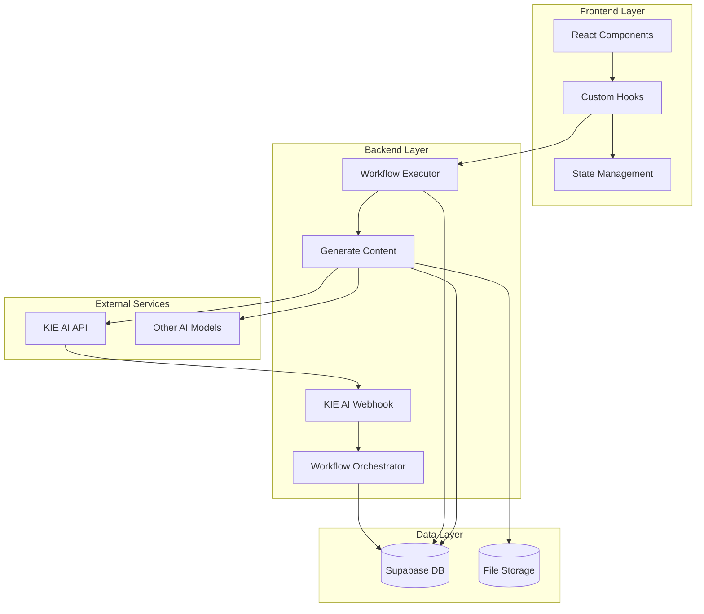
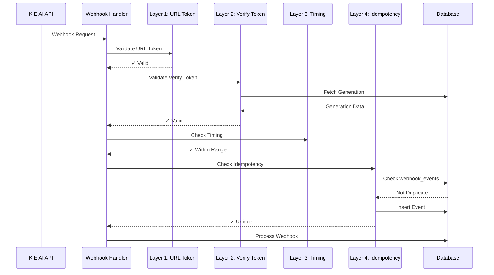
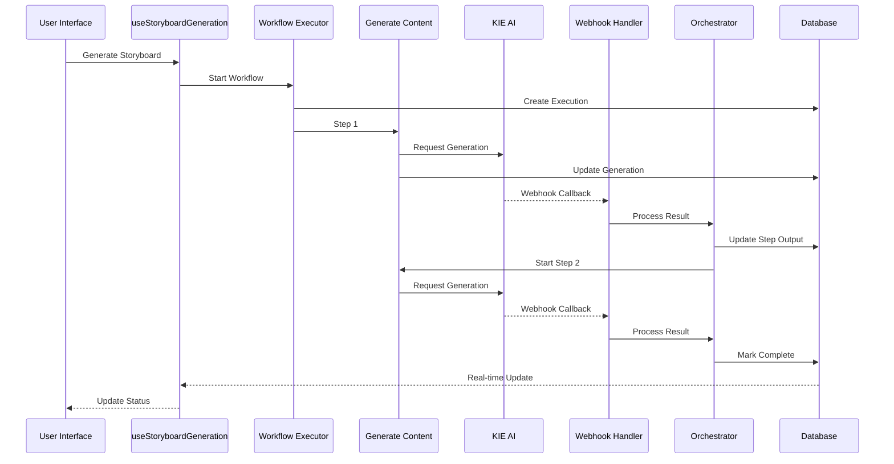
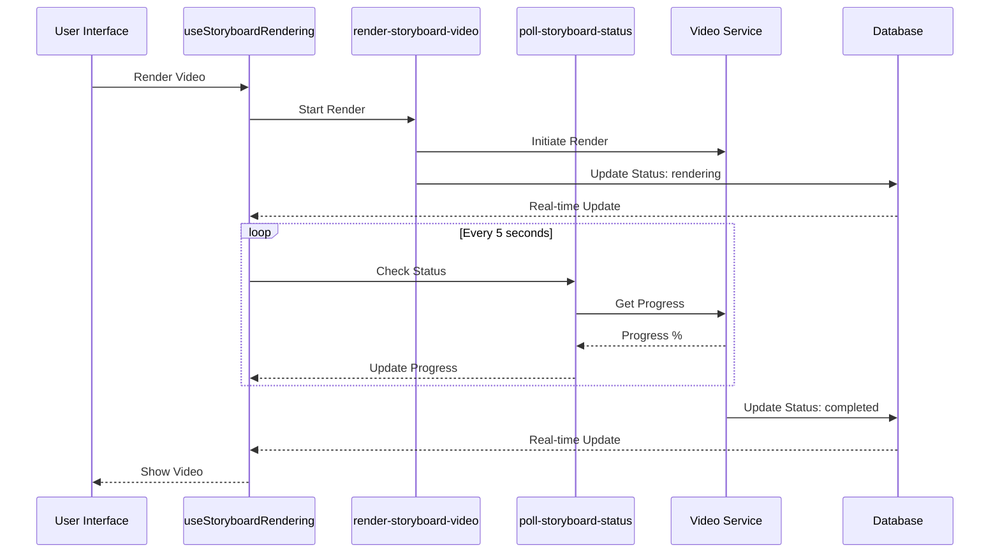

# KIE AI Video Platform - Architecture Documentation

## Overview

This document describes the modular architecture of the KIE AI Video Platform, focusing on the refactored components and their interactions.

---

## Table of Contents

1. [System Architecture](#system-architecture)
2. [Webhook Processing System](#webhook-processing-system)
3. [Workflow Orchestration](#workflow-orchestration)
4. [Frontend Architecture](#frontend-architecture)
5. [Security Layers](#security-layers)
6. [Data Flow](#data-flow)

---

## System Architecture



---

## Webhook Processing System

### Location
`supabase/functions/kie-ai-webhook/`

### Architecture

The webhook system is organized into modular components:

```
kie-ai-webhook/
├── index.ts                    # Main webhook handler
├── security/                   # Security validation layers
│   ├── url-token-validator.ts
│   ├── verify-token-validator.ts
│   ├── timing-validator.ts
│   └── idempotency-validator.ts
└── orchestration/              # Workflow orchestration
    ├── workflow-orchestrator.ts
    └── parameter-resolver.ts
```

### Security Layers

The webhook implements a **4-layer security architecture**:

#### Layer 1: URL Token Validation
- **File**: `security/url-token-validator.ts`
- **Purpose**: Validates static URL token from query parameters
- **Behavior**: Returns 404 if invalid (endpoint appears non-existent)

```typescript
validateUrlToken(url: URL): ValidationResult
```

#### Layer 2: Verify Token Validation
- **File**: `security/verify-token-validator.ts`
- **Purpose**: Validates per-generation webhook token
- **Features**: 
  - Retry logic for race conditions
  - Checks generation status (not cancelled/processed)
  
```typescript
validateVerifyToken(url: URL, taskId: string, supabase): Promise<VerifyTokenResult>
```

#### Layer 3: Timing Validation
- **File**: `security/timing-validator.ts`
- **Purpose**: Detects replay attacks and late arrivals
- **Thresholds**:
  - MIN_PROCESSING_TIME: 2 seconds (prevents replay attacks)
  - MAX_PROCESSING_TIME: 5 minutes (logs late webhooks)

```typescript
validateTiming(generation: any, supabase): Promise<TimingResult>
```

#### Layer 4: Idempotency Protection
- **File**: `security/idempotency-validator.ts`
- **Purpose**: Prevents duplicate webhook processing
- **Mechanism**: Tracks processed events in `webhook_events` table

```typescript
validateIdempotency(taskId, callbackType, generation, supabase): Promise<IdempotencyResult>
```

### Orchestration Module

#### Workflow Orchestrator
- **File**: `orchestration/workflow-orchestrator.ts`
- **Purpose**: Manages multi-step workflow execution
- **Features**:
  - Tracks step outputs
  - Chains workflow steps
  - Handles final output URLs
  - Token usage tracking

```typescript
orchestrateWorkflow(generation, storagePath, isMultiOutput, supabase): Promise<void>
```

#### Parameter Resolver
- **File**: `orchestration/parameter-resolver.ts`
- **Purpose**: Resolves template variables and parameters
- **Features**:
  - Template variable replacement
  - Input mapping resolution
  - Schema coercion
  - Parameter sanitization

```typescript
replaceTemplateVariables(template, context): string
resolveInputMappings(mappings, context): Record<string, any>
coerceParametersToSchema(params, schema): Record<string, any>
sanitizeParametersForProviders(params, userId, supabase): Promise<Record<string, any>>
```

---

## Workflow Orchestration

### Location
`supabase/functions/workflow-executor/`

### Architecture

```
workflow-executor/
├── index.ts                    # Main executor
└── helpers/
    ├── image-upload.ts         # Image processing
    └── parameter-resolver.ts   # Parameter handling
```

### Modules

#### Image Upload Helper
- **File**: `helpers/image-upload.ts`
- **Functions**:
  - `uploadBase64Image()`: Converts base64 to signed URL
  - `processImageUploads()`: Processes user input images
  - `sanitizeParametersForProviders()`: Sanitizes all parameters

#### Parameter Resolver
- **File**: `helpers/parameter-resolver.ts`
- **Functions**:
  - `getNestedValue()`: Dot notation object access
  - `replaceTemplateVariables()`: Template string replacement
  - `resolveInputMappings()`: Maps inputs to parameters
  - `coerceParametersToSchema()`: Type coercion

---

## Frontend Architecture

### Storyboard System

The storyboard functionality is split into focused hooks:

```
src/hooks/storyboard/
├── useStoryboardState.ts       # State management & data fetching
├── useStoryboardSettings.ts    # Settings updates
├── useStoryboardGeneration.ts  # Storyboard generation
├── useStoryboardScenes.ts      # Scene manipulation
├── useStoryboardRendering.ts   # Video rendering
└── useStoryboardForm.ts        # Form state management
```

### Component Architecture

```
src/components/storyboard/
├── StoryboardInput.tsx         # Main input form (refactored)
└── sections/                   # Form sections
    ├── TopicSection.tsx
    ├── DurationSection.tsx
    ├── ResolutionSelector.tsx
    ├── StyleSelector.tsx
    ├── ToneSelector.tsx
    ├── MediaTypeSelector.tsx
    └── CostDisplay.tsx
```

### Hook Responsibilities

#### useStoryboardState
- Manages current storyboard and active scene IDs
- Fetches storyboard and scene data from database
- Handles local storage persistence

#### useStoryboardSettings
- Updates render settings (voice, quality, subtitles, etc.)
- Manages storyboard configuration

#### useStoryboardGeneration
- Initiates storyboard generation workflow
- Handles generation parameters and validation

#### useStoryboardScenes
- Scene CRUD operations
- Scene regeneration
- Preview generation for all scenes

#### useStoryboardRendering
- Video rendering process
- Polling for render status
- Real-time updates via Supabase subscriptions
- Render cancellation

#### useStoryboardForm
- Form state management
- Input validation
- Settings persistence

---

## Security Layers

### Security Flow



### Audit Logging

All security events are logged to the `audit_logs` table:
- Invalid webhook attempts
- Duplicate webhook blocks
- Timing violations
- Token validation failures

---

## Data Flow

### Storyboard Generation Flow



### Video Rendering Flow



---

## Design Principles

### Modularity
- **Single Responsibility**: Each module handles one specific concern
- **Loose Coupling**: Modules interact through well-defined interfaces
- **High Cohesion**: Related functionality is grouped together

### Security
- **Defense in Depth**: Multiple security layers
- **Fail Secure**: Returns 404 on security failures
- **Audit Trail**: Comprehensive logging of security events

### Scalability
- **Stateless Functions**: Edge functions don't maintain state
- **Async Processing**: Long operations handled via webhooks
- **Database-Driven**: State managed in Supabase

### Maintainability
- **Clear Structure**: Logical file organization
- **Type Safety**: TypeScript throughout
- **Documentation**: Inline comments and architecture docs

---

## Testing Strategy

### Unit Tests
- Security validators (all 4 layers)
- Parameter resolvers
- Image upload helpers

### Integration Tests
- Webhook processing flow
- Workflow orchestration
- Frontend hook interactions

### End-to-End Tests
- Complete storyboard generation
- Video rendering process
- Error recovery scenarios

---

## Future Improvements

1. **Caching Layer**: Redis for frequently accessed data
2. **Rate Limiting**: Per-user request throttling
3. **Monitoring**: Comprehensive metrics and alerts
4. **Load Balancing**: Distribute webhook processing
5. **Retry Logic**: Automatic retry for transient failures
6. **Dead Letter Queue**: Handle failed webhooks

---

## Glossary

- **Generation**: A single AI generation request and its result
- **Workflow**: Multi-step AI generation pipeline
- **Storyboard**: Collection of scenes for video generation
- **Scene**: Individual video segment with script and media
- **Webhook**: Callback from external AI service
- **Orchestrator**: System that chains workflow steps
- **Edge Function**: Serverless function running on Supabase

---

## Contact & Support

For questions about this architecture, please refer to:
- Code comments in relevant files
- This documentation
- Team technical lead
