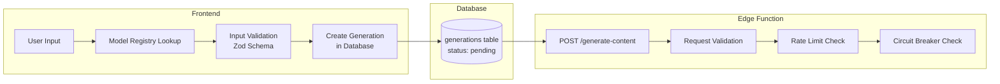
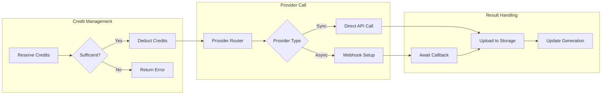
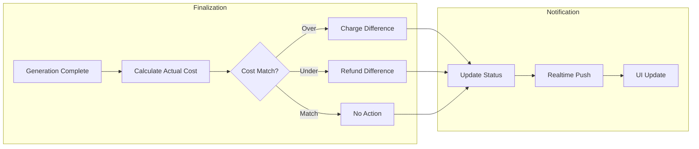
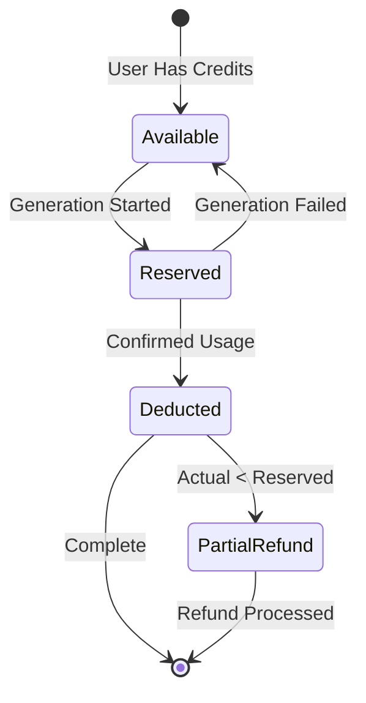
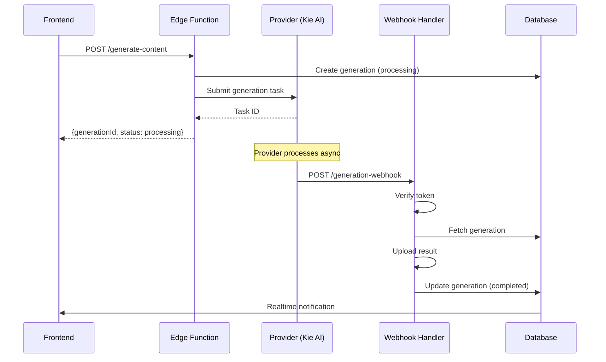
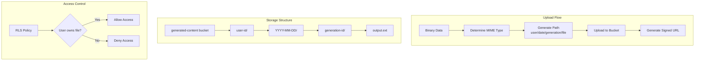
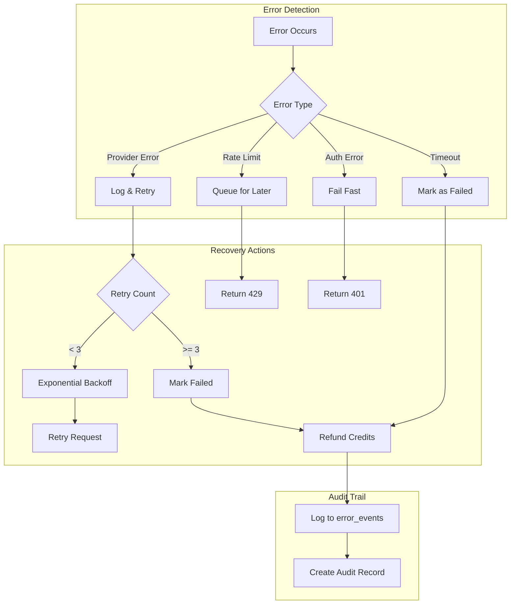
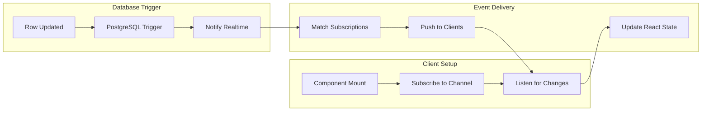
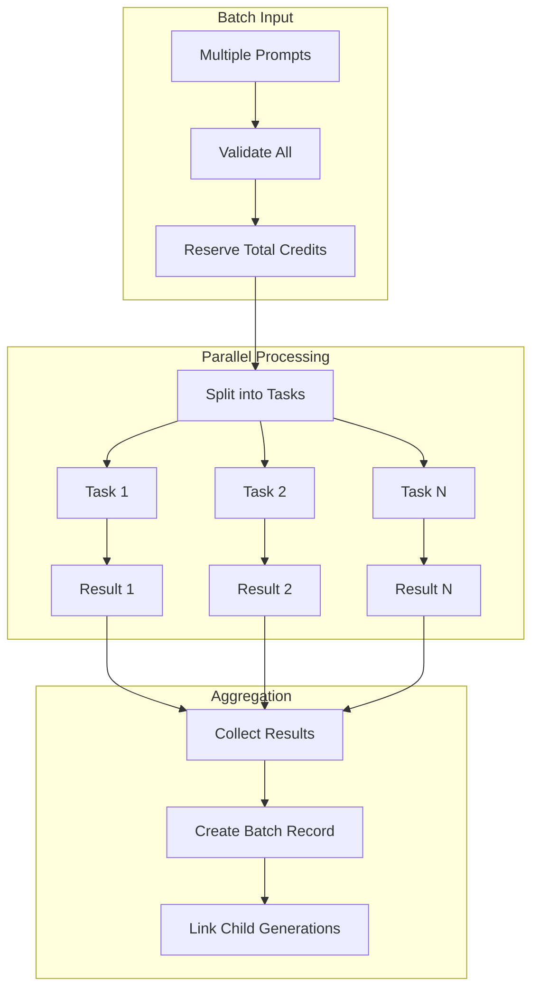

# Data Flow Architecture

## Generation Data Flow

### 1. Initiation Phase

### 2. Processing Phase

### 3. Completion Phase

## Credit System Flow

### Credit Transaction Types

| Transaction | Direction | Trigger |
|-------------|-----------|---------|
| `reservation` | Debit | Generation start |
| `usage` | Debit | Generation complete |
| `refund` | Credit | Generation failure |
| `adjustment` | Credit | Over-reservation |
| `purchase` | Credit | Token purchase |
| `bonus` | Credit | Promotional grant |

## Async Generation Flow (Webhooks)

## Storage Data Flow

## Error Recovery Flow

## Realtime Subscription Flow

## Batch Processing Flow

## Cache Strategy

| Data Type | Cache Location | TTL | Invalidation |
|-----------|---------------|-----|--------------|
| Model Registry | Memory (Registry) | Infinite | Deploy |
| User Credits | TanStack Query | 30s | Mutation |
| Generation Status | TanStack Query | 5s | Realtime |
| Voice List | TanStack Query | 5min | Manual |
| Storage URLs | Signed URL | 1hr | N/A |
