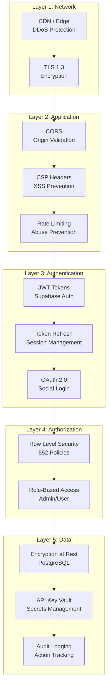
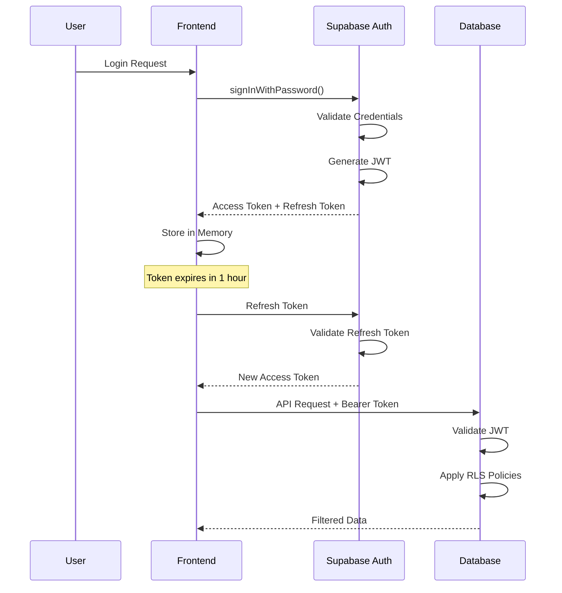
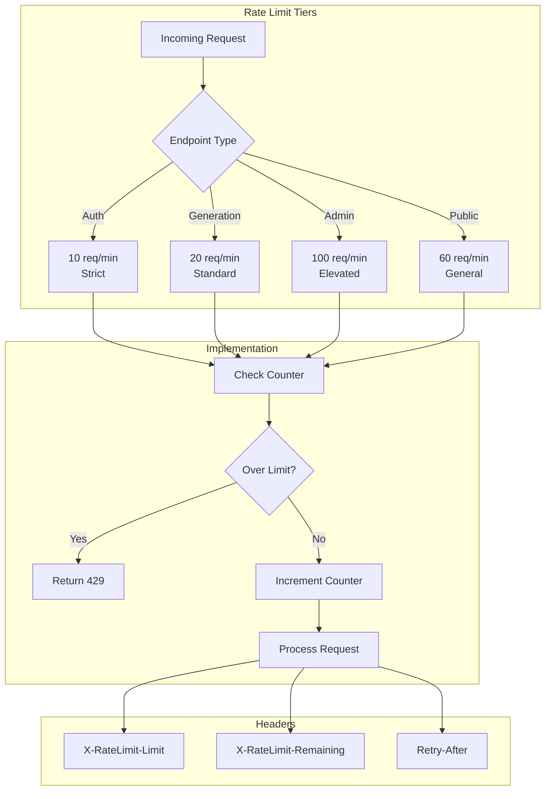
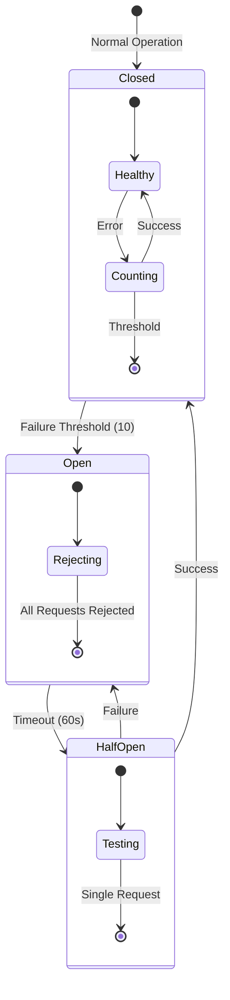
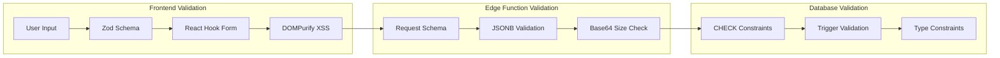
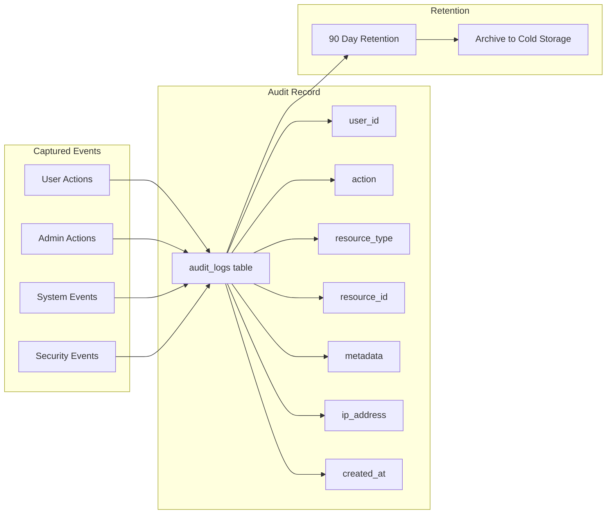
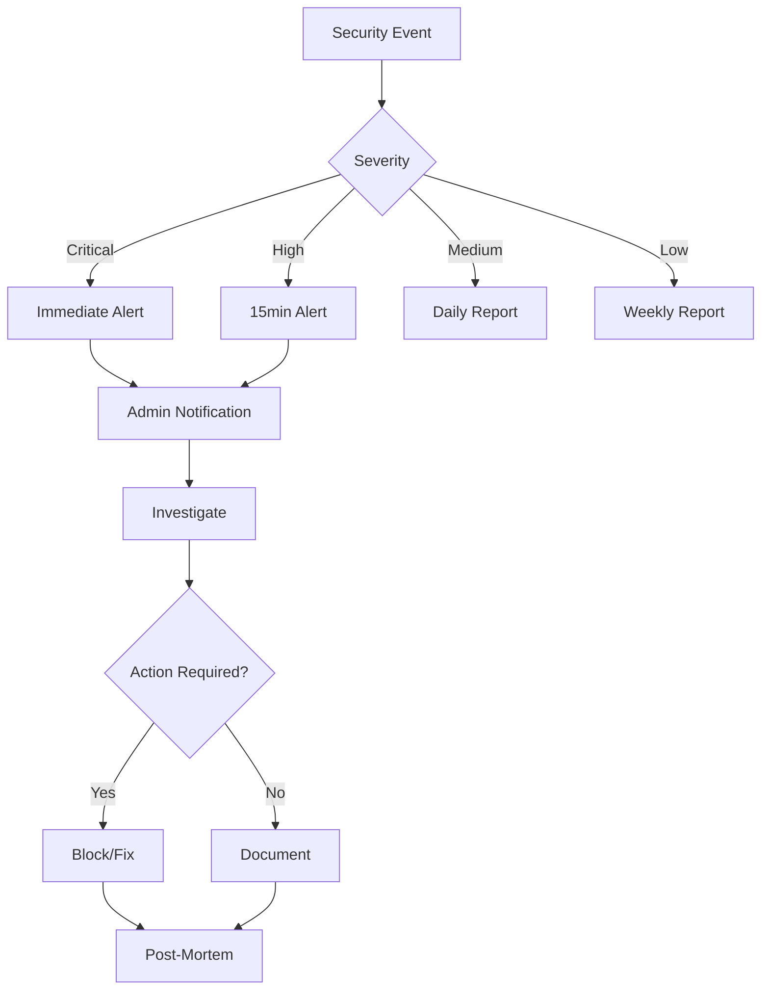

# Security Model Architecture

## Security Layers Overview



## Authentication Flow



## Row Level Security (RLS)

### Policy Structure

```sql
-- Example: Users can only read their own generations
CREATE POLICY "Users can view own generations"
ON generations FOR SELECT
USING (auth.uid() = user_id);

-- Example: Admins can view all
CREATE POLICY "Admins can view all generations"
ON generations FOR SELECT
USING (
  EXISTS (
    SELECT 1 FROM profiles
    WHERE id = auth.uid()
    AND is_admin = true
  )
);
```

### RLS Coverage by Table

| Table | SELECT | INSERT | UPDATE | DELETE | Total |
|-------|--------|--------|--------|--------|-------|
| generations | ✓ | ✓ | ✓ | ✓ | 4 |
| profiles | ✓ | ✓ | ✓ | ✗ | 3 |
| credit_transactions | ✓ | ✓ | ✗ | ✗ | 2 |
| storage.objects | ✓ | ✓ | ✓ | ✓ | 4 |
| ... | ... | ... | ... | ... | ... |
| **Total** | | | | | **552** |

## Rate Limiting Architecture



## Circuit Breaker Pattern



## Input Validation Layers



### Validation Schema Example

```typescript
const GenerateContentRequestSchema = z.object({
  generationId: z.string().uuid(),
  model_config: z.object({
    modelId: z.string().min(1).max(100),
    provider: z.enum(['runware', 'kie_ai', 'lovable_ai_sync']),
    baseCreditCost: z.number().min(0).max(10000),
  }),
  prompt: z.string().min(1).max(10000),
  custom_parameters: z.record(z.unknown()).optional(),
});
```

## Secrets Management

```mermaid
flowchart TB
    subgraph "Secret Types"
        A[API Keys] --> D[Supabase Vault]
        B[Webhook Tokens] --> D
        C[Service Keys] --> D
    end

    subgraph "Access Control"
        D --> E{Edge Function}
        E --> F[Deno.env.get()]
        F --> G[Scoped Access]
    end

    subgraph "Rotation"
        H[Key Rotation] --> I[Update Vault]
        I --> J[Redeploy Functions]
    end
```

### Secret Categories

| Category | Storage | Access | Rotation |
|----------|---------|--------|----------|
| Provider API Keys | Vault | Edge Functions | Manual |
| Supabase Keys | Environment | All Functions | Auto |
| Webhook Tokens | Database | Per-Generation | Per-Request |
| Signing Keys | Vault | Admin Functions | 90 days |

## Audit Logging



### Audited Actions

| Category | Actions |
|----------|---------|
| Authentication | login, logout, password_reset, email_verify |
| Generation | create, complete, fail, delete |
| Credits | purchase, use, refund, grant |
| Admin | user_ban, settings_change, model_update |
| Security | rate_limit_hit, auth_fail, suspicious_activity |

## Content Security Policy

```html
<meta http-equiv="Content-Security-Policy" content="
  default-src 'self';
  script-src 'self' 'unsafe-inline' 'unsafe-eval';
  style-src 'self' 'unsafe-inline';
  img-src 'self' data: https: blob:;
  font-src 'self' data:;
  connect-src 'self' https://*.supabase.co wss://*.supabase.co;
  frame-ancestors 'none';
  base-uri 'self';
  form-action 'self';
">
```

## Security Checklist

- [x] JWT authentication on all protected endpoints
- [x] RLS policies on all user data tables
- [x] Rate limiting on all endpoints
- [x] Circuit breakers for external APIs
- [x] Input validation (Zod + JSONB)
- [x] XSS prevention (DOMPurify)
- [x] CORS with origin validation
- [x] Audit logging
- [x] Secrets in Vault (not code)
- [x] No source maps in production
- [x] Error message sanitization
- [x] Base64 DoS protection
- [ ] CSP headers (partial)
- [ ] Request signing for admin
- [ ] CAPTCHA for auth endpoints

## Incident Response


