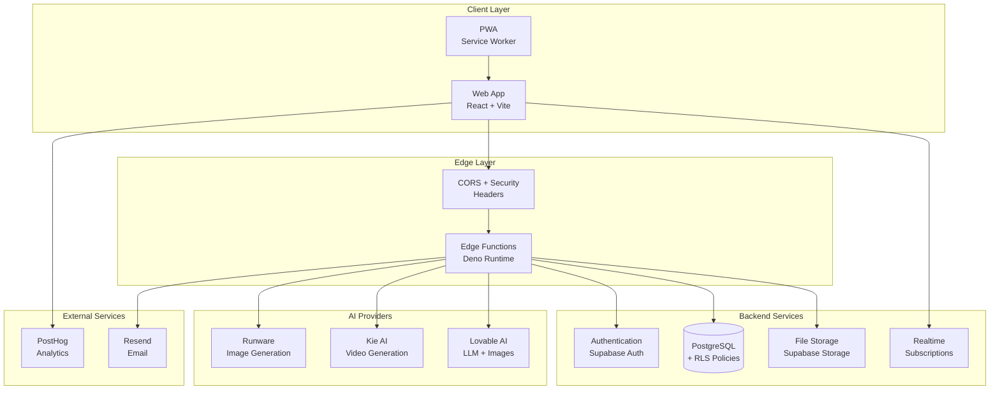
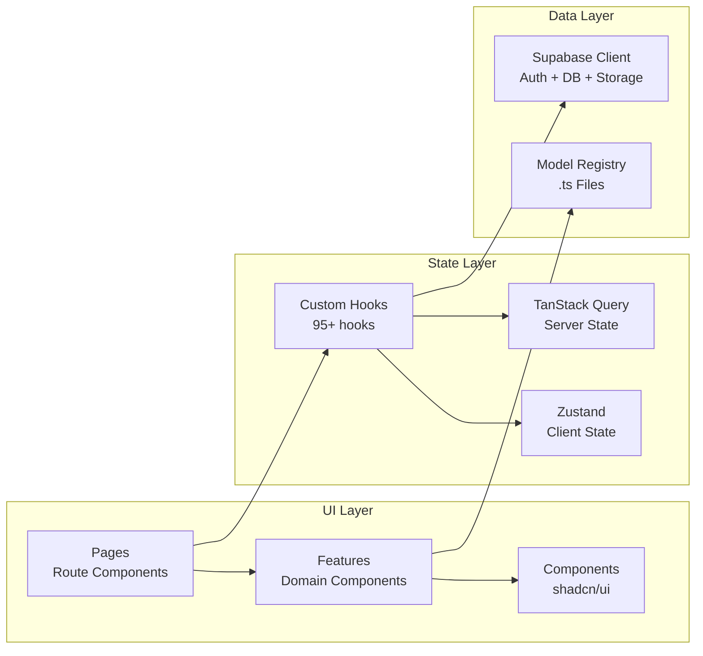
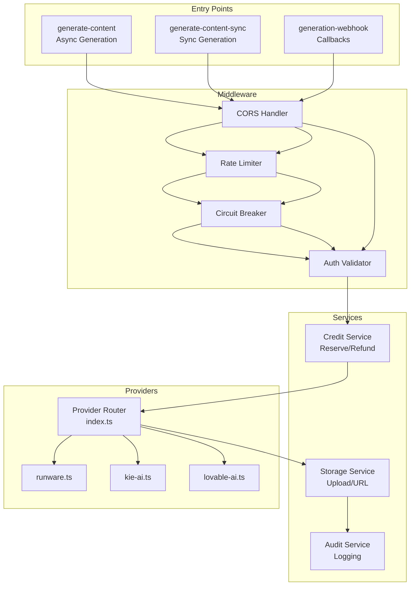
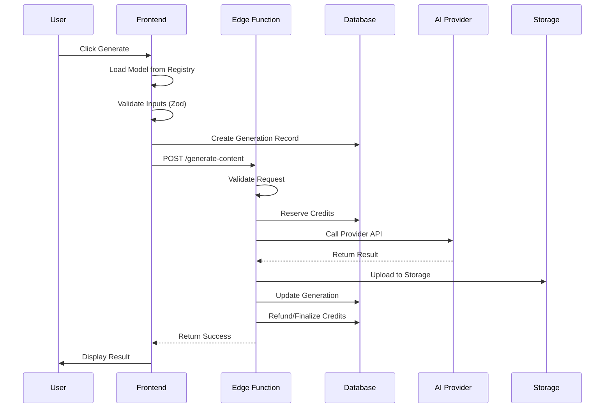
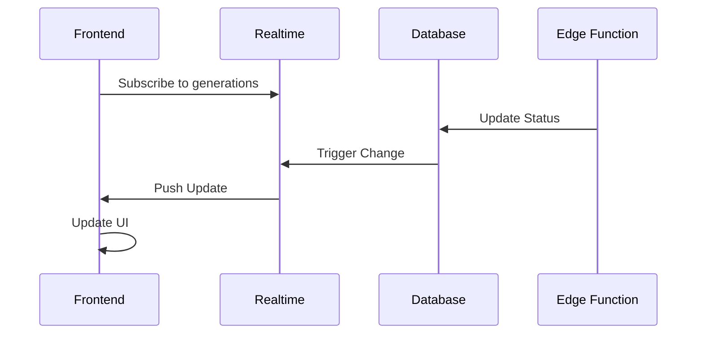

# Artifio.ai System Architecture Overview

## High-Level Architecture

## Component Architecture

### Frontend (React + TypeScript)

### Edge Functions Architecture

## Data Flow

### Generation Request Flow

### Realtime Status Flow

## Key Design Decisions

| Decision | Rationale | Reference |
|----------|-----------|-----------|
| Registry-based Models | Eliminates DB sync issues, single source of truth | ADR-007 |
| Edge Functions | Serverless, auto-scaling, secure secrets | ADR-001 |
| RLS Policies | Row-level security for multi-tenant isolation | - |
| Circuit Breakers | Resilience against provider failures | - |
| Webhook Callbacks | Support for async long-running generations | - |

## Security Layers

1. **Authentication**: Supabase JWT tokens
2. **Authorization**: 552 RLS policies across all tables
3. **Rate Limiting**: Tiered limits (auth/generation/admin)
4. **Circuit Breakers**: Provider failure isolation
5. **Input Validation**: Zod schemas + JSONB validation
6. **Content Moderation**: Prompt filtering
7. **Audit Logging**: Comprehensive action tracking

## Scalability Considerations

- **Horizontal**: Edge functions auto-scale
- **Concurrent Limit**: 750 simultaneous requests
- **Rate Limits**: 20 generations/min per user
- **Storage**: CDN-backed Supabase Storage
- **Database**: Connection pooling via Supabase
